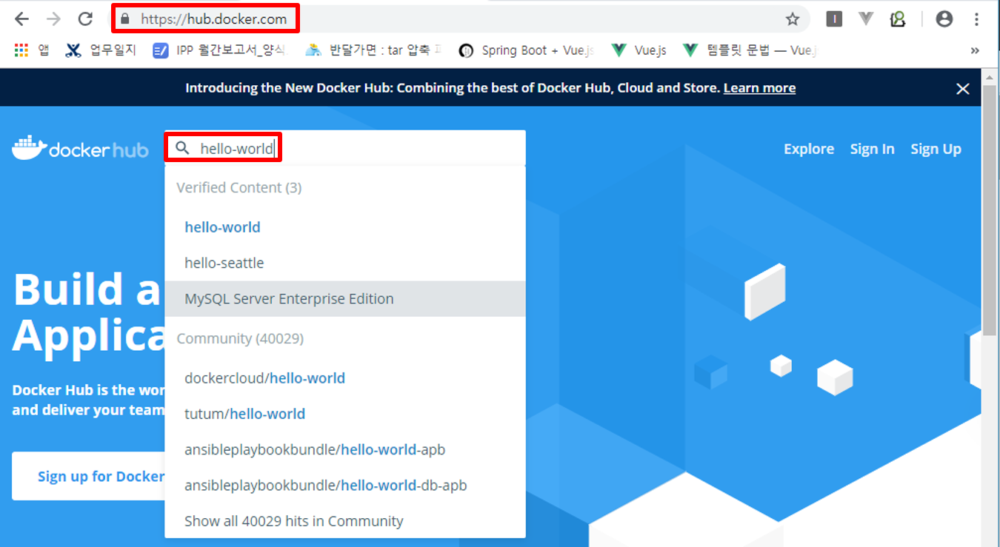
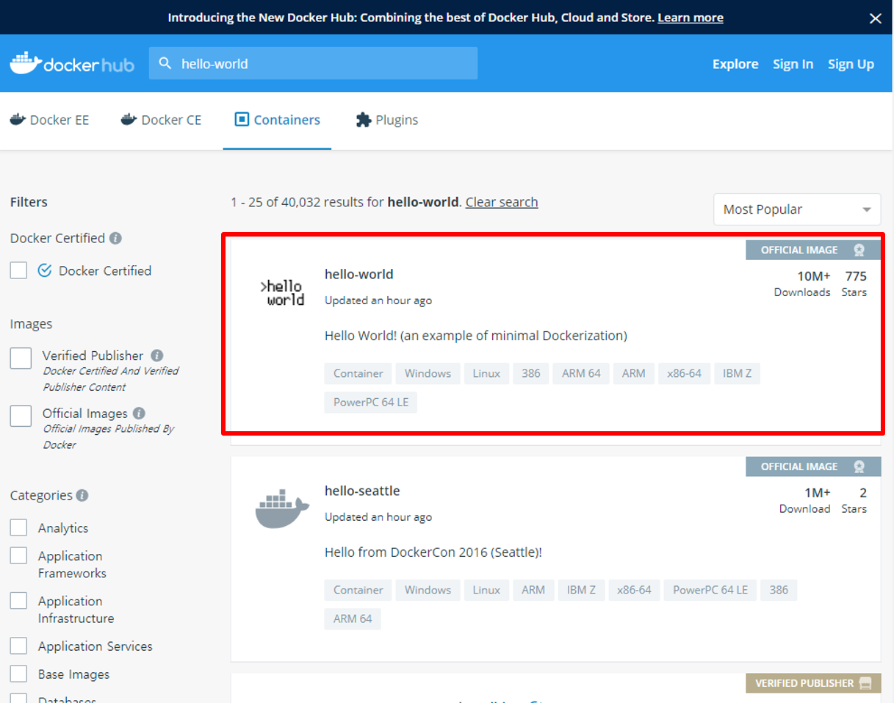
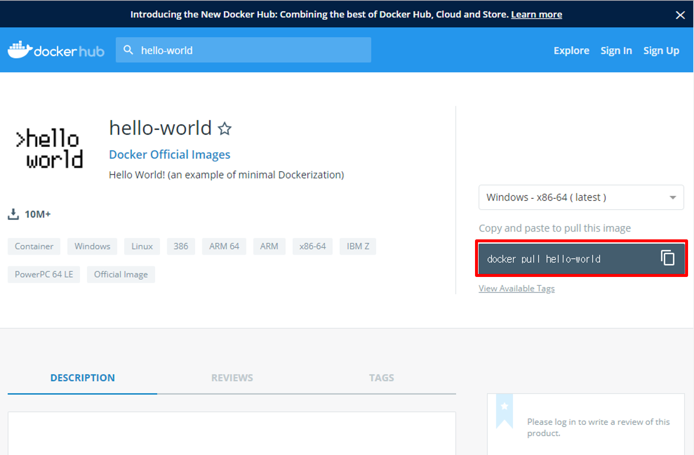

EdgeX
=======
1 EdgeX(사용자) 실행환경 설치(버전별)
------------------------------------
1.1 Ubuntu 16.04 LTS
^^^^^^^^^^^^^^^^^^^^^
* 패키지 업데이트 실행
::

  $ sudo apt-get update
  
* curl 설치
::

  $ sudo apt-get install curl
  
* git 설치
::

   $ sudo apt-get install git
   
* mongoDB 설치
::

  $ sudo apt-get install mongodb-clients mongodb-server
  
* docker 설치
::

  $ curl –fsSL https://get.docker.com | sudo sh
  # 설치 완료 후 현재 접속 사용자에게 권한 주기
  $ sudo usermod –aG docker $USER 

* docker-compose 설치
::
  
  $ sudo curl –L https://github.com/docker/compose/releases/download/1.23.1/docker-compose-$(uname -s)-$(uname –m) -o /usr/local/bin/docker-compose
  # 설치 완료 후
  $ sudo chmod +x /usr/local/bin/docker-compose

1.2 Ubuntu mate (banana-PI R2)
^^^^^^^^^^^^^^^^^^^^^^^^^^^^^^^
* 패키지 업데이트 실행
::

  $ sudo apt-get update
  
* curl 설치
::

  $ sudo apt-get install curl
  
* git 설치
::

   $ sudo apt-get install git
   
* mongoDB 설치
::

  $ sudo apt-get install mongodb-clients mongodb-server
  
* docker 설치
::

  $ curl –fsSL https://get.docker.com | sudo sh
  # 설치 완료 후 현재 접속 사용자에게 권한 주기
  $ sudo usermod –aG docker $USER 

* docker-compose 설치
  
::

  # pip 가 있는지 version 검사를 진행
  $ pip -V
  
  # pip 가 없으면 install 진행
  $ yum install python-pip
  $ pip -V
  
  # docker-compose 설치
  $ pip install docker-compose
  
2 EdgeX(사용자) 실행환경 설치 확인
------------------------------------
* mongoDB 설치 확인

::

  $ mongod --version
  $ mongo --version

* docker, docker-compose 설치 확인

::

  $ docker --version
  $ docker-compose--version

* git 설치 확인

::

  $ git --version
  
3 EdgeX (사용자) 실행 파일 설치
------------------------------
* EdgeX 실행파일 clone
::

  $ sudo git clone https://github.com/edgexfoundry/developer-scripts.git

* git 파일 확인(docker-compose.yml)
::

  $ cd compose-files

4 EdgeX(사용자) 실행
--------------------
* EdgeX 실행 ( ``compose-files`` 디렉토리에서 실행)
::

  $ docker-compose pull
  #파일 다운이 다 된 후
  $ docker-compose up -d

* EdgeX 실행 확인
::

  $ docker ps -a

5 EdgeX (사용자) 실행 참고
--------------------------
* EdgeX 실행 중 mongodb 에러가 날 경우
  - mongoDB 실행 확인 후 중지
::
  
  $ service mongodb status
  $ service mongodb stop

6 EdgeX (개발자) 실행파일 설치
------------------------------
6.1 EdgeX 실행파일 설치 (edgex-go clone)
^^^^^^^^^^^^^^^^^^^^^^^^^^^^^^^^^^^^^^^^^^^^
::

  $ git clone https://github.com/edgexfoundry/edgex-go.git

- EdgeX 실행파일 clone 확인
::

  $ cd edgex-go
  $ ls
  
6.2 docker image(hello-world) 생성
^^^^^^^^^^^^^^^^^^^^^^^^^^^^^^^^^^^^
- https://hub.docker.com/ 접속 후 상단에 hello-world 검색

   
- hello-world 클릭

   
- docker pull hello-world 복사

   
6.3 docker-compose 파일 수정
^^^^^^^^^^^^^^^^^^^^^^^^^^^^
- ``vi docker-compose.yml`` 수정

::

  삽입할 이미지 정보 입력
   - images : 도커 이미지 이름
   - ports : 이미지 포트 지정
   - container_name : 컨테이너 이름
   - networks : edgex-network 입력

6.4 EdgeX 실행 (edgex-go 디렉토리에서 실행)
^^^^^^^^^^^^^^^^^^^^^^^^^^^^^^^^^^^^^^^^^^^^^^

::

  $ docker-compose up
  
  # 에러 발생 시
  $ docker-compose down
  $ docker-compose up
