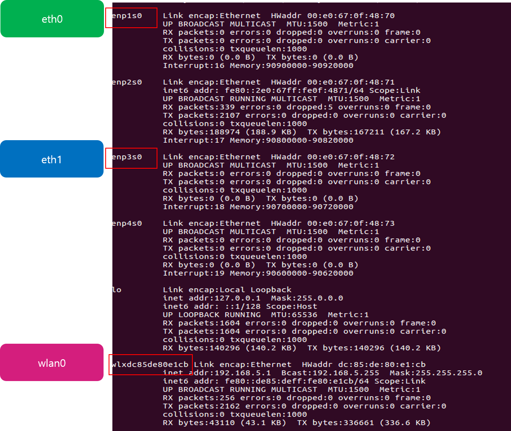

Ubuntu AP 설치 가이드
=====================
1. 개요
---------
Atom board 디바이스에 ubuntu16.04 LTS 기반으로 한 AP를 제공한다.

2. 장비 구성
------------
Atom board(제작사 : PROTECTLI, 모델 : Model-FW4A-0)

3. AP에 필요한 package 
-------------------------
VM ubuntu 16.04 LTS 버전을 설치하여, terminal를 이용해 AP 설치에 필요한 소스를 구성한다.

3.1 AP 지원 여부 확인
^^^^^^^^^^^^^^^^^^^^^^

::

  $ sudo apt-get install iw 
  $ sudo iw list
  
::

  [결과 화면]
  …
  Supported interface modes: 
    * IBSS 
    * managed 
    * AP 
    * AP/VLAN 
    * monitor 
    * mesh point
  …

3.2 package install 및 update
^^^^^^^^^^^^^^^^^^^^^^^^^^^^^^
기본으로 설치된 패키지들을 업그레이드 한다.

::

  $ sudo apt-get update
  $ sudo apt-get upgrade –y
  $ sudo apt-get update

무선 네트워크를 지원하기 위한 패키지를 설치한다.

::

  $ sudo apt-get install hostapd
  
외부로 나가는 포트를 하나의 포트로 만들기 위한 패키지를 설치한다.

::

  $ sudo apt-get install bridge-utils
  
dnsmasq 구성을 위한 패키지를 설치한다.

::

  $ sudo apt-get install dnsmasq

방화벽을 설정하기 위한 패키지를 설치한다.

::
  
  $ sudo apt-get install iptables

3.3 interface name 확인
^^^^^^^^^^^^^^^^^^^^^^^^^

4. hostapd 네트워크 호스트 설정
-------------------------------

4.1 hostapd.conf 편집
^^^^^^^^^^^^^^^^^^^^^^^^
무선 네트워크 연결 설정을 할 hostapd.conf 파일을 생성, 내용을 추가한다.

::

  $ sudo vi /etc/hostapd/hostapd.conf
  
::

  [내용 추가]

  driver=nl80211 
  interface={와이파이를 송신할 인터페이스 이름 | wlan0} 
  bridge=br0 
  hw_mode=g 
  channel=6 
  ssid={와이파이 이름}
  # Accept all MAC address
  macaddr_acl=0 
  # Shared Key Authentication
  auth_algs=1 
  ignore_broadcast_ssid=0 
  wpa=2 
  wpa_passphrase={와이파이 비밀번호(8자 이상)}
  # Key management algorithms
  wpa_key_mgmt=WPA-PSK 
  # Set cipher suites (encryption algorithms)
  # TKIP = Temporal Key Integrity Protocol

4.2 hostapd 파일 편집
^^^^^^^^^^^^^^^^^^^^^
Hostapd.conf이 실행될 수 있도록 수정한다.

::

  $ sudo vi /etc/default/hostapd
  
::

  [내용 수정]
  …
  DAEMON_CONF="/etc/hostapd/hostapd.conf"  
  …

5. dnsmasq 구성
---------------
5.1 dnsmasq.conf 편집
^^^^^^^^^^^^^^^^^^^^^^^^

dnsmasq.conf를 dhcp 서버 구성과 dns 설정을 위해 아래와 같이 수정한다.

::

  $ sudo vi /etc/dnsmasq.conf
  
::

  interface=br0
  listen-address=192.168.1.150
  bind-interfaces
  server=8.8.8.8
  domain-needed
  bogus-priv
  dhcp-range=192.168.1.40, 192.168.1.200,12h

6. Network Interfaces 설정
------------------------------

네트워크가 들어오는 eth0은 고정 ip로 설정해주고, br0는 네트워크가 외부로 나가는 wlan0(무선 네트워크)와 eth1 포트를 브릿지로 연결하고, 
고정 ip를 192.168.1.xxx 대역으로 설정한다.

::

  $ sudo vi /etc/network/interfaces
  
::

  auto lo
  iface lo inet loopback

  auto enp1s0 
  iface enp1s0 inet static
       address 10.11.1.53
       netmask 255.255.0.0
       gateway 10.11.0.1
       dns-nameserver 39.119.118.231

  auto br0
  iface br0 inet static
       bridge_ports wlan0 enp3s0
       address 192.168.1.150
       netmask 255.255.255.0
       dns-nameserver 39.119.118.231

7. ipv4 포워딩 셋업
--------------------

``$ sudo vi /etc/sysctl.conf`` net.ipv4.ip_forward=1 부분을 찾은 후, 앞에 #(주석 표시) 제거한다.

8. hostap 구성
-----------------
8.1 initHostap 파일 생성 및 편집
^^^^^^^^^^^^^^^^^^^^^^^^^^^^^^^^^

::

  $ sudo vi initHostap
  
::

  #!/bin/bash

  # 방화벽 해제
  rfkill unblock all

  iptables –F FORWARD
  iptables –P FORWARD DROP

  sysctl –w net.ipv4.ip_forward=1

  echo 1 | sudo tee /proc/sys/net/ipv4/ip_forward

  #nat 설정
  iptables –t nat –A POSTROUTING –o enp1s0 –j MASQUERADE
  iptables –A FORWARD –i enp1s0 –o br0 –m state --state RELATED,ESTABLISHED –j ACCEPT
  iptables –A FORWARD –i br0 –o enp1s0 –j ACCEPT

  # 무선네트워크 실행
  /usr/sbin/hostapd –dd /etc/hostapd/hostapd.conf

  # stop
  iptables –D POSTROUTING –t nat –o enp1s0 –j MASQUERADE
  sysctl –w net.ipv4.ip_forward=0
  service hostapd stop

8.2 initHostap 실행 권한 부여
^^^^^^^^^^^^^^^^^^^^^^^^^^^^^^
ls 명령어를 통해 initHostap 의 권한 상태를 확인한다.

::

  $ ls -l
  
InitHostap 파일이 실행 파일이 아니면 흰색으로 표시된다. 
(만약, 초록색으로 표시가 된다면 다음 명령어를 수행하지 않아도 됨)

::

  $ sudo chmod +x initHostap
  

9. hostap 실행
--------------
9.1 시스템 재시작
^^^^^^^^^^^^^^^^^

::

  $ reboot
  
9.2 Bridge 연결 상태 확인
^^^^^^^^^^^^^^^^^^^^^^^^^
bridge 상태를 확인한다.(interfaces에서 bridge_ports로 연결한 포트들과 일치해야 함.)

::
  
  $ brctl show
  

9.3 dnsmasq 재시작
^^^^^^^^^^^^^^^^^^^^^^
dnsmasq를 재시작한다.

::

  $ sudo service dnsmasq restart
  
9.4 dnsmasq 상태 확인
^^^^^^^^^^^^^^^^^^^^^
dnsmasq 상태를 확인한다. (Active : active (running))

::

  $ sudo systemctl status dnsmasq

9.5 ifconfig를 통해 고정 ip 확인
^^^^^^^^^^^^^^^^^^^^^^^^^^^^^^^^^^^^
Ifconfig 명령어를 통해 br0와 eth0의 ip를 확인한다.
(br0 은 192.168.1.xxx 대역, eth0은 10.11.1.xx 대역으로 잡혀야 함)

::

  $ ifconfig
  

9.6 initHostap 실행
^^^^^^^^^^^^^^^^^^^^^^
initHostap를 실행한다.

::

  $ sudo ./initHostap
