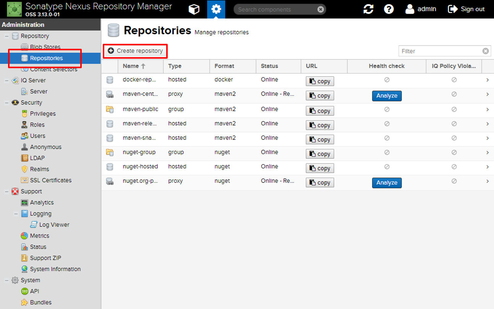

Docker Registry Nexus
===========================
1 docker registry 구성
------------------------
1.1 docker registry nexus 테스트 환경 구성
^^^^^^^^^^^^^^^^^^^^^^^^^^^^^^^^^^^^^^^^^^^^^
아래와 같이 테스트 환경을 구성한다.
::

  OS : Ubuntu 16.04
  
::
  
  Docker Version : Docker version 18.05.0-ce

1.2 Nexus 설치
^^^^^^^^^^^^^^^
* nexus에서 사용 할 data 폴더 생성 및 권한 변경
  
  - nexus official image 에서 user 를 200 으로 사용한다. 
  
  - 만약 호스트에서 따로 데이터를 관리하지 않을 경우에는 아래 부분을 하지 않아도 된다.

::

  $ mkdir ~/nexus-data && sudo chown -R 200 ~/nexus-data

* 위 생성한 폴더로 nexus 실행
  위 내용을 하지 않은 경우 -v /home/ubuntu/nexus-data:/nexus-data 없이 시작

::

  $ docker run -d -p 8081:8081 -p 12000:12000 --name nexus -v /root/nexus-data:/nexus-data sonatype/nexus3

1.3 Nexus 접속
^^^^^^^^^^^^^^^
* http://[ 설치한 IP ]:8081
* 관리자 ID/PASSWD -> admin/admin123

2 Nexus Docker Registry 설정
-----------------------------
2.1 관리자 로그인 후 설정 창 이동
^^^^^^^^^^^^^^^^^^^^^^^^^^^^^^^^^^^
.. image:: images/02.png
   :scale: 50 %
   :alt: alternate text

2.2 Repositories -> Create repository
^^^^^^^^^^^^^^^^^^^^^^^^^^^^^^^^^^^^^^^^

   
2.3 docker (hosted) 선택 및 다음과 같이 설정 후 repository를 생성한다.
^^^^^^^^^^^^^^^^^^^^^^^^^^^^^^^^^^^^^^^^^^^^^^^^^^^^^^^^^^^^^^^^^^^^^^

   
3 docker 설정 변경 및 재시작
------------------------------
3.1 docker 설정 변경
^^^^^^^^^^^^^^^^^^^^^
::

  $ sudo sh -c "echo 'DOCKER_OPTS=\"\$DOCKER_OPTS --insecure-registry=http://18.220.55.181:12000\"' >> /etc/default/docker"

3.2 docker repository file 생성
^^^^^^^^^^^^^^^^^^^^^^^^^^^^^^^^^^
* ``$ sudo vi /etc/docker/daemon.json`` 파일 생성한다.

::

  {
	  "insecure-registries": ["[Nexus 서버 IP 또는 도메인]:12000"]
  }

3.3 Docker 재시작
^^^^^^^^^^^^^^^^^^^^^^
::

  $ sudo service docker restart    
   
또는 

::
 
  $ sudo systemctl restart docker.service

3.4 Docker 상태 확인
^^^^^^^^^^^^^^^^^^^^^^^^^^
::

  docker start nexus

4 docker registry nexus 사용방법
----------------------------------
4.1 docker registry server -> #Server1 | other server -> #Server2
^^^^^^^^^^^^^^^^^^^^^^^^^^^^^^^^^^^^^^^^^^^^^^^^^^^^^^^^^^^^^^^^^^
* #Server1
  - 로그인 및 docker image upload

::

  $ docker login -u admin 39.119.118.153:12000
  $ docker pull hello-world
  $ docker tag hello-world 18.220.55.181:12000/hello-world
  $ docker push 18.220.55.181:12000/hello-world
  $ docker rmi hello-world 18.220.55.181:12000/hello-world
  $ docker pull 18.220.55.181:12000/hello-world
  $ docker images
  
* #Server2
  - 3번의 daemon.json file 생성 후 docker 재시작
  - 로그인 및 docker image download

::

  $ docker login -u admin 18.220.55.181:12000
  $ docker pull 18.220.55.181:12000/hello-world

5 기타
-------
5.1 admin 비밀번호 변경
^^^^^^^^^^^^^^^^^^^^^^^^

5.2 사용자 계정 생성
^^^^^^^^^^^^^^^^^^^^^^^^
* 설정 -> Users -> Create local user
* 각 입력란에 입력 후 권한을 부여한다.

   
5.3 생성된 repository 와 해당 repository의 image 목록 확인
^^^^^^^^^^^^^^^^^^^^^^^^^^^^^^^^^^^^^^^^^^^^^^^^^^^^^^^^^^
* Browse -> Repository 선택

