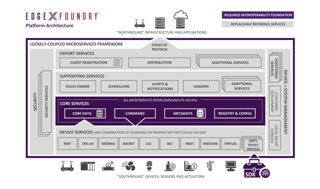

2장.  SCN-보안 게이트웨이 플랫폼
=======================================

2.1 IoT 표준 미들웨어 플랫폼 기술 설계
--------------------------------------

2.1.1 oneM2M, LWM2M, TR-069, ... 
~~~~~~~~~~~~~~~~~~~~~~~~~~~~~~~~~~
설명....

2.1.2 지원 프로토콜...
~~~~~~~~~~~~~~~~~~~~~~~
BLE, Z-Wave, Ethernet, NB-IoT, LoRa, RS-232/422, CoAP, REST, MQTT, ZIGBEE 등

2.2 컨테이너 기반 IoT 서비스 플랫폼 설계
---------------------------------------------

2.2.1 응용 서비스
~~~~~~~~~~~~~~~~~~~~~~~~
클라이언트 등록, oneM2M, LWM2M, TR-069 -> docker container...

2.2.2 지원 서비스
~~~~~~~~~~~~~~~~~~~~~~~~

2.2.2.1 EdgeX Foundry
^^^^^^^^^^^^^^^^^^^^^^^^

EdgeX Foundry는 핵심 서비스 계층(core-service)을 중심으로 장치 서비스
계층의 물리적 영역에 걸쳐 있는 오픈 소스 마이크로소스의 모음입니다.
이러한 서비스는 API를 통해 통신하므로 사용자의 추가적인 이미지 구현으로
보강 또는 대체될 수 있다.

EdgeX 설명...

2.2.3 코어 서비스
~~~~~~~~~~~~~~~~~~~~~~~~
EdgeX 설명...

2.3 네트워크 트래픽 제어 기술 설계
------------------------------------

2.3.1 OVS(Open Virtual Switch)
~~~~~~~~~~~~~~~~~~~~~~~~~~~~~~~~~
설명....

2.4 IoT 서비스 Register 관리 설계
---------------------------------

2.4.1 Docker Repository
~~~~~~~~~~~~~~~~~~~~~~~~~~
설명....
