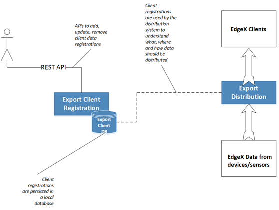
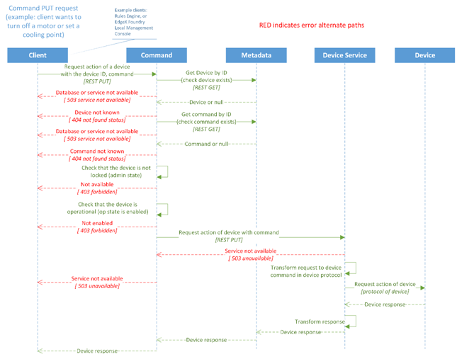

2장.  SCN-보안 게이트웨이 플랫폼
=======================================

2.1 IoT 표준 미들웨어 플랫폼 기술 설계
--------------------------------------

2.1.1 oneM2M, LWM2M, TR-069, ... 
~~~~~~~~~~~~~~~~~~~~~~~~~~~~~~~~~~
설명....

2.1.2 지원 프로토콜...
~~~~~~~~~~~~~~~~~~~~~~~
BLE, Z-Wave, Ethernet, NB-IoT, LoRa, RS-232/422, CoAP, REST, MQTT, ZIGBEE 등

2.2 컨테이너 기반 IoT 서비스 플랫폼 설계
---------------------------------------------

2.2.1 응용 서비스
~~~~~~~~~~~~~~~~~~~~~~~~
클라이언트 등록, oneM2M, LWM2M, TR-069 -> docker container...

2.2.2 지원 서비스
~~~~~~~~~~~~~~~~~~~~~~~~

2.2.2.1 EdgeX Foundry
^^^^^^^^^^^^^^^^^^^^^^^^
EdgeX Foundry는 핵심 서비스 계층(core-service)을 중심으로 장치 서비스
계층의 물리적 영역에 걸쳐 있는 오픈 소스 마이크로소스 그룹이다.
이러한 서비스는 API를 통해 통신하므로 사용자의 추가적인 이미지 구현으로
보강 또는 대체될 수 있다.

.. image:: images/2.2.2.1-EdgeX구조.png
   :scale: 20 %
   :alt: alternate text

core 서비스를 기준으로 South Side, North Side로 나뉜다.

========== ===================================================================================================================================
**name**   **Description**
========== ===================================================================================================================================
South Side 물리적 영역 내 모든 IoT 객체 및 해당 디바이스, 센서 엑추에이터 등의 IoT 객체와 직접 통신하고 이들로 데이터를 수집하는 네트워크 집합
North Side 데이터를 수집, 저장, 수집 및 분석하여 정보로 변환하는 클라우드, 엔터프라이즈 시스템 및 통신하는 네트워크.
========== ===================================================================================================================================

EdgeX는 서비스 간 필요한 상호 운용성을 제공함으로써 물리적인 항목을 보다
쉽게 ​​모니터하고, 지침을 보내고, 데이터를 수집하고, 안개를 가로 질러
데이터를 저장, 집계, 분석 및 전환 할 수 있는 클라우드 서비스로 데이터를
이동시킬 수 있다.

.. image:: images/2.2.2.1-EdgeX범위.png
   :scale: 20 %
   :alt: alternate text

즉 EdgeX는 Industrial IoT Edge에 중점적으로 설계되어 있으며 클라우드의
고유 원칙을 활용함과 동시에 IP 및 비 IP 기반 연결 프로토콜, 광범위하게
분산 된 컴퓨팅을 위한 보안 및 시스템 관리를 수용하는 등 IoT edge의 특정
요구사항을 충족하도록 설계되어져 있다.

2.2.2.1.1 EdgeX 서비스 레이어
^^^^^^^^^^^^^^^^^^^^^^^^^^^^^^^^
EdgeX의 서비스는 크게 4가지 분류로 되어 있다

============== ==============================================================================================
**name**       **Description**
============== ==============================================================================================
core 서비스    edgeX의 핵심 기능 (메타데이터, 코어데이터, 커멘드)을 수행함
device 서비스  디바이스(IoT)와 상호 작용하는 커넥터 서비스.
support 서비스 센싱 데이터 분석 및 필터, 로깅, 스케줄링 및 데이터 정리와 같은 일반적인 소프트웨어 응용 서비스
export 서비스  edgeX와 연결된 (North Side) 클라우드에 데이터 전송 서비스를 수행함.
============== ==============================================================================================

support 서비스 레이어
^^^^^^^^^^^^^^^^^^^^^^^^^^^^^^^^

edgeX에서 제공하고 있는 서포트 서비스 레이어는 다음과 같다.

===================== ====================================================
**name**              **Description**
===================== ====================================================
alert & notifications 다른 객체 혹은 사람에게 알림을 보내는 서비스
logging               edgex-networks 의 모든 컨테이너 서비스의 로그를 제공
scheduling            코어 데이터를 호출하여 서비스 이벤트 정리.
rules engine          이벤트 트리거, 참조 구현을 제공.
===================== ====================================================

alert & notifications 서비스
~~~~~~~~~~~~~~~~~~~~~~~~~~~~~

서비스 노드에서 마이크로 서비스간 혹은 사용자, 시스템에 alert을
보내야하는 경우 alert & notification 서비스에서 해당 정보를 전달한다.
이는 다른 서비스에서 특정 매개 변수 또는 시스템, 서비스 오작동 및 감지된
센서 데이터를 broadcast 및 경고, 알람으로 전달한다.

.. image:: images/2.2.2.2.2.1-alert_notification서비스.png
   :scale: 20 %
   :alt: alternate text

alert & notifications API
^^^^^^^^^^^^^^^^^^^^^^^^^

===================================================== ============== ==================================
**Mapping Url**                                       **Method**     **Description**
===================================================== ============== ==================================
/notification                                         POST           알림 수신, 배포
/notification/slug/{slug}                             GET            slug 기준 알림 조회
/notification/age/{age}                               DELETE         타임 스템프 기준 알림 삭제
/notification/sender/{sender}/{limit}                 GET            sender 기준으로 알림 조회
/notification/start/{start}/end/{end}/{limit}         GET            기간별 기준 알림 조회
/notification/start/{start}/{limit}                   GET            시작일 기준 알림 조회
/notification/end/{end}/{limit}                       GET            종료일 기준 알림 조회
/notification/labels/{labels}/{limit}                 GET            레이블 기준 알림 조회
/notification/new/{limit}                             GET            처리되지 않는 알림 조회
/subscription                                         GET, POST, PUT GET : 알림 전송 대상 조회

                                                                     POST : 알림 전송 대상 생성

                                                                     PUT : 알림 전송 대상 수정
/subscription/slug/{slug}                             GET, DELETE    GET : slug 기준 전송 대상 조회

                                                                     DELETE : slug 기준 전송 대상 삭제
/subscription/categories/{categories}/labels/{labels} GET            라벨, 카테고리 기준 전송 대상 조회
/subscription/categories/{categories}                 GET            카테고리 기준 전송 대상 조회
/subscription/labels/{labels}                         GET            라벨 기준 전송 대상 조회
/subscription/receiver/{receiver}                     GET            이름 기준 전송 대상 조회
/transmission/slug/{slug}/{limit}                     GET            slag 기준 알림 전송정보 조회
/transmission/start/{start}/end/{end}/{limit}         GET            기간별 알림 전송정보 조회
/transmission/start/{start}/{limit}                   GET            시작일 기준 전송정보 조회
/transmission/end/{end}/{limit}                       GET            종료일 기준 전송정보 조회
/transmission/escalated/{limit}                       GET            escalated 기준 전송정보 조회
/transmission/failed/{limit}                          GET            실패된 전송정보 조회
/transmission/sent/age/{age}                          DELETE         age 기준 전송정보 삭제
/transmission/escalated/age/{age}                     DELETE         escalated age 기준 전송정보 삭제
/transmission/acknowledged/age/{age}                  DELETE         수신확인, age 기준 전송정보 삭제
/transmission/failed/age/{age}                        DELETE         전송 실패, age 기준 전송정보 삭제
/cleanup                                              DELETE         모든 알림 삭제
/cleanup/age/{age}                                    DELETE         age 기준 알림 삭제
/ping                                                 GET            서비스 ping 테스트
===================================================== ============== ==================================

logging 서비스
~~~~~~~~~~~~~~~

EdgeX에서 작동하는 서비스 및 서비스 간 작용, 문제를 logging 요청을
보내는 서비스. debug, info, warn, error, fatal logging 레벨을 지원한다.

 logging API
^^^^^^^^^^^
=========================================================== ========== ===================================================
**Mapping Url**                                             **Method** **Description**
=========================================================== ========== ===================================================
/logs                                                       POST       로그 생성
/logs/{limit}                                               GET        로그 조회
/logs/{start}/{end}/{limit}                                 GET        시작일 기준 로그 조회
/logs/labels/{labels}/{start}/{end}/{limit}                 GET        라벨, 기간 기준 로그 조회
/logs/originServices/{originServices}/{start}/{end}/{limit} GET        서비스, 기간 기준 로그 조회
/logs/keywords/{keywords}/{start}/{end}/{limit}             GET        키워드, 기간 기준 로그 조회
/logs/logLevels/{logLevels}/originServices/                 GET        서비스, 로그레벨, 기간 기준 로그 조회
{originServices}/{start}/{end}/{limit}
/logs/logLevels/{logLevels}/originServices/                 GET        로그레벨, 서비스, 라벨, 키워드, 기간 기준 로그 조회
{originServices}/labels/{labels}/keywords/
{keywords}/{start}/{end}/{limit}
/logs/{start}/{end}                                         DELETE     기간 기준 로그 삭제
/logs/labels/{labels}/{start}/{end}                         DELETE     라벨, 기간 기준 로그 삭제
/logs/originServices/{originServices}/{start}/{end}         DELETE     서비스, 기간 기준 로그 삭제
/logs/keywords/{keywords}/{start}/{end}                     DELETE     키워드, 기간 기준 로그 삭제
/logs/logLevels/{logLevels}/{start}/{end}                   DELETE     로그레벨, 기간 기준 로그 삭제
/logs/logLevels/{logLevels}/originServices/                 DELETE     로그레벨, 서비스, 기간 기준 로그 삭제
{originServices}/{start}/{end}
/logs/logLevels/{logLevels}/originServices/                 DELETE     로그레벨, 서비스, 라벨, 기간 기준 로그 삭제
{originServices}/labels/{labels}/{start}/{end}
/logs/logLevels/{logLevels}/originServices/                 DELETE     로그레벨, 서비스, 라벨, 키워드, 기간 기준 로그 삭제
{originServices}/labels/{labels}/keywords/
{keywords}/{start}/{end}
/ping                                                       GET        로깅 서비스 핑 테스트
/config                                                     GET        로깅 서비스 상태 조회
=========================================================== ========== ===================================================

scheduling 서비스
~~~~~~~~~~~~~~~~~~

scheduling 마이크로 서비스는 edgeX에 구동하고 있는 마이크로 서비스 및
이벤트를 관리하고 export 된 core-data를 읽는 Scrubbeer 서비스를 동작 및
관리한다.

scheduling API
^^^^^^^^^^^^^^

=============== ========== =======================================
**Mapping Url** **Method** **Description**
=============== ========== =======================================
/info/{name}    GET        이름 기준 스케줄 정보 조회
/ping           GET        scheduling 서비스 핑 테스트
/flush          GET        모든 스케줄 flush 및 메타데이터 리로드.
=============== ========== =======================================

rule engine 서비스
~~~~~~~~~~~~~~~~~~~

rule engine 서비스는 참조, 이벤트 trigger 메커니즘을 제공한다. edgeX에
들어오는 센서 및 센싱 데이터를 범위 내 판독 및 모니터링 하고 장치 작동을
trigger 한다.

.. image:: images/2.2.2.2.2.3-rule_engine서비스.png
   :scale: 20 %
   :alt: alternate text

rule engine 서비스가 시작되면 자동으로 Export Client Registration
마이크로 서비스를 호출하여 core-data 에서 나오는 모든 장치 및 센서 판독
값을 클라이언트로 등록한다. export 서비스 클라이언트의 rule engine
서비스는 export 마이크로 서비스를 통해 모든 이벤트와 판독 값을 수신한다.

rule engine API
^^^^^^^^^^^^^^^

===================== ========== ============================
**Mapping Url**       **Method** **Description**
===================== ========== ============================
/rule                 GET, POST  POST : 새 규칙 추가

                                 GET : 모든 규칙 이름 조회
/rule/name/{rulename} DELETE     이름 기준 규칙 삭제
/ping                 GET        rule engine 서비스 핑 테스트
===================== ========== ============================

export 서비스 레이어
^^^^^^^^^^^^^^^^^^^^^^^^^

edgeX에서 제공하고 있는 export 서비스 레이어는 다음과 같다.

=================== ==========================================
**name**            **Description**
=================== ==========================================
client Registration 데이터 수신자 등록 서비스
distribution        데이터 파이프 및 필터 아키텍처 제공 서비스
=================== ==========================================

client Registration
~~~~~~~~~~~~~~~~~~~
EdgeX client Registration 서비스는 클라이언트가 게이트웨이에 core-data를
통해 전송되는 데이터의 수신자로 등록할 수 있는 서비스이다.

client Registration API
~~~~~~~~~~~~~~~~~~~~~~~

============================== ============== ====================================
**Mapping Url**                **Method**     **Description**
============================== ============== ====================================
/registration/id/{id}          DELETE         DB Id 기준 클라이언트 삭제
/registration/name/{name}      DELETE, GET    DETEL : 이름 기준 클라이언트 삭제

                                              GET : 이름 기준 클라이언트 조회
/registration/{id}             GET            ID 기준으로 클라이언트 조회
/registration                  POST, GET, PUT POST : 클라이언트 등록
                                              PUT : 클라이언트 수정
                                              GET : 모든 클라이언트 조회
/registration/reference/{type} GET            type 기준 클라이언트 조회
/ping                          GET            client Registration 핑 테스트
/config                        GET            client Registration 서비스 상태 조회
============================== ============== ====================================

distribution
~~~~~~~~~~~~

distribution(Export Distro) 서비스는 메세지 대기열을 통해 core data에서
데이터를 수신 한 다음 등록된 클라이언트 별로 데이터를 필터링 및 변환,
포맷화 한다. 이후 클라이언트가 데이터를 요청하면 REST, MQTT, 0MQ를 통해
클라이언트 엔트 포인트에 데이터를 전달한다.

distribution서비스는 엔터프라이즈 응용 프로그램 통합 패턴을 기반으로
하는 파이프 및 필터 아키텍처로 설계되어 있다.

기본적으로 core-data는 각 장치 또는 센서 이벤트를 판독 값과 함께 ZeroMQ
주체로 비동기 적으로 push된다. distribution 서비스는 들어오는 이벤트에
대한 push된 해당 항목을 수신한 후, 수신된 이벤트는 메시지로 처리되고
export distribution 파이프 및 필터를 통해 전송되어 등록 된 클라이언트에
배포된다.

2.2.3 코어 서비스
~~~~~~~~~~~~~~~~~~~~~~~~

코어 서비스 레이어
------------------

CS (Core Services) 레이어는 가장자리의 북쪽 레이어와 남쪽 레이어를
분리한다. 코어서비스에는 다음 구성 요소가 포함하고 있다.

================= ==============================================================================================================================================================
**name**          **Description**
================= ==============================================================================================================================================================
Core data         South Side 로부터 수집 된 데이터에 대한 지속성 저장소 및 관련 관리 서비스.
Command           North Side의 South Side 작동 제어 요청을 제어하는 ​서비스
Metadata          EdgeX Foundry에 연결된 개체에 대한 메타 데이터의 저장소 및 관련 관리 서비스. 새로운 장치를 프로비저닝하고 소유 한 장치 서비스와 쌍을 이룰 수 있는 기능을 제공.
Registry & Config 다른 EdgeX Foundry 마이크로서비스에 EdgeX Foundry 및 마이크로서비스 구성 특성(즉, 초기화 값의 리포지토리) 내에서 관련 서비스에 대한 정보를 제공.
================= ==============================================================================================================================================================

코어 데이터 서비스
~~~~~~~~~~~~~~~~~~

코어 데이터 서비스는 장치 및 센서에서 수집한 데이터 판독을 위해 중앙
집중식 지속성 기능을 제공한다. 이는 달리 말하자면 전송 된 장치 및 센서가
수집한 센싱 데이터를 유지하는 서비스이다. 또한 REST API를 사용하여
데이터를 로컬 저장소 또는 저장소 외부로 이동하는 역활을 하며 ZeroMQ를
통해 export 서비스 레이어로 데이터를 이동시킨다.

코어 데이터 서비스 데이터 모델
^^^^^^^^^^^^^^^^^^^^^^^^^^^^^^

코어 데이터 서비스 데이터 사전
^^^^^^^^^^^^^^^^^^^^^^^^^^^^^^

================ =============================
**name**         **Description**
================ =============================
Event            - ID Device

                 - Identifier

                 - Collection of Readings
Reading          키 - 값 쌍으로 이루어져 있다.
Value Descriptor 로그 파일을 지정함
================ =============================

코어 데이터 API
^^^^^^^^^^^^^^^

========================================== ============== ==============================================
**Mapping Url**                            **Method**     **Description**
========================================== ============== ==============================================
/event                                     POST, PUT, GET | POST : 새 이벤트 추가
                                                          | PUT : 이벤트 데이터 수정

                                                          GET : 모든 이벤트 조회
/event/{id}                                GET            id 기준 이벤트 조회
/event/count                               GET            core-data 내 이벤트 갯수 조회
/event/count/{deviceId}                    GET            디바이스 id 기준 core-data 이벤트 갯수 조회
/event/id/{id}                             DELETE, PUT    DELETE : DB id 기준 이벤트 삭제
                                                          PUT : DB id 기준 이벤트 수정
/event/device/{deviceId}/{limit}           GET            디바이스 id 기준 지정 갯수 만큼 이벤트 조회
/event/device/{deviceId}                   DELETE         디바이스 id 기준 이벤트 조회
/event/{start}/{end}/{limit}               GET            기간, 지정 갯수 만큼 이벤트 조회
/event/device/{deviceId}                   GET            디바이스 id, 판독 값 기준으로 이벤트 조회

/valuedescriptor/{valuedescriptor}/{limit}
/event/removeold/age/{age}                 DELETE         age 기준 이벤트 삭제
/event/scrub                               DELETE         scrub 관련 푸시 이벤트 전체 삭제
/reading                                   POST, PUT, GET POST : 리소스 추가

                                                          PUT : 리소스 수정

                                                          GET : 전체 리소스 조회
/reading/count                             GET            전체 리소스 갯수 조회
/reading/{id}                              GET            id 기준 리소스 조회
/reading/id/{id}                           DELETE         id 기준 리소스 삭제
/reading/device/{deviceId}/{limit}         GET            디바이스 id, 갯수 기준 조회
/reading/name/{name}/device/               GET            리소스 이름, 디바이스 이름(id), 갯수 기준 조회

{device}/{limit}
/reading/name/{name}/{limit}               GET            리소스 이름, 갯수 기준 조회
/reading/uomlabel/{uomLabel}/{limit}       GET            UoM 레이블, 갯수 기준 조회
/reading/label/{label}/{limit}             GET            라벨, 갯수 기준 조회
/reading/type/{type}/{limit}               GET            타입, 갯수 기준 조회
/reading/{start}/{end}/{limit}             GET            기간별 기준 조회
/valuedescriptor                           POST, PUT, GET | POST : 값 설명자 생성
                                                          | PUT : 값 설명자 수정

                                                          GET : 값 설명자 조회
/valuedescriptor/id/{id}                   DELETE         id 기준 값 설명자 삭제
/valuedescriptor/name/{name}               GET, DELETE    GET : 이름 기준 값 설명자 조회

                                                          DELETE : 이름 기준 값 설명자 삭제
/valuedescriptor/{id}                      GET            id 기준 값 설명 자 조회
/valuedescriptor/devicename/{name}         GET            디바이스 이름 기준 연관된 모든 값 설명자 조회
/valuedescriptor/deviceid/{id}             GET            디바이스 id 기준 연관된 모든 값 설명자 조회
/valuedescriptor/uomlabel/{uomLabel}       GET            UoM 라벨 기준 연관된 모든 값 설명자 조회
/valuedescriptor/label/{label}             GET            레이블 기준 값 설명자 조회
/ping                                      GET            core-data 서비스 핑 테스트
/config                                    GET            core-data 서비스 상태 조회
========================================== ============== ==============================================

커멘드 서비스
~~~~~~~~~~~~~

커멘드 서비스는 장치 및 센서에 명령 또는 동작을 할 수 있게 하는
서비스이다. 장치에 대한 명령은 GET 명령, 장치 또는 센서의 데이터 요청 및
명령 PUT, EdgeX Foundry에서 작업을 수행하거나 새 설정 또는 데이터를
수신하라는 요청을 통해 이루어지며 또한 장치 및 센서 주변에 보호 계층을
제공하고 있다.

커멘드 API
^^^^^^^^^^

=========================================== ========== ================================================
**Mapping Url**                             **Method** **Description**
=========================================== ========== ================================================
/ping                                       GET        core-command 서비스 핑 테스트
/config                                     GET        core- command 서비스 상태 조회
/metrics                                    GET        서비스의 metrics 상태 정보 조회
/device/{id}/command/{commandid}            GET, PUT   GET : 디바이스 id, 커멘드 id 기준 연관 장치 조회

                                                       PUT : 디바이스 id, 커멘드 id 기준 정보 수정
/device/{id}/adminstate/{adminState}        PUT        디바이스 id 기준 관리자 상태 정보 수정
/device/{id}/opstate/{opState}              PUT        디바이스 id 기준 장치 op상태 정보수정
/device/{id}                                GET        디바이스 id 기준 커멘드 offering 조회
/device/name/{name}/adminstate/{adminState} PUT        디바이스 이름 기준 장치 관리자 상태 정보 수정
/device/name/{name}/opstate/{opState}       PUT        디바이스 이름 기준 장치 op상태 정보 수정
/device/name/{name}                         GET        장치 이름 기준 장치 커멘드 정보 조회
/device                                     GET        모든 장치 커멘드 정보 조회
=========================================== ========== ================================================

메타데이터 서비스
~~~~~~~~~~~~~~~~~

메타 데이터 서비스는 장치, 센서에 대한 정보, 데이터 및 유형, 명령 그리고
다른 서비스에서 사용하는 장치 및 센서와 통신에 필요한 메타데이터를
관리하는 서비스이다.

메타 데이터 API
^^^^^^^^^^^^^^^

============================================== ============== ====================================================
**Mapping Url**                                **Method**     **Description**
============================================== ============== ====================================================
/ping                                          GET            core-metadata 서비스 핑 테스트
/config                                        GET            core- metadata 서비스 상태 조회
/device/id/{id}                                DELETE         디바이스 id 기준 디바이스 삭제
/device/check/{token}                          GET            id, 이름 기준 장치 리소스 조회
/device/name/{name}/opstate/{opState}          PUT            장치 이름 기준 상태 수정
/device/name/{name}/adminstate/{adminState}    PUT            장치 이름 기준 관리 상태 수정
/device/name/{name}/lastreported/{time}        PUT            장치 이름 기준 시간 수정
/device/name/{name}/lastreported/              PUT            장치 이름 기준 변경사항 알림 여부 수정

{time}/{notify}
/device/name/{name}/lastconnected/{time}       PUT            장치 이름 기준 마지막 연결 정보 수정
/device/name/{name}/lastconnected/             PUT            장치 이름 기준 마지막 통신 시간 설정

{time}/{notify}
/device/name/{name}                            GET, DELETE    GET : 장치 이름 기준 정보 조회

                                                              DELETE : 장치 이름 기준 정보 삭제
/device/{id}/opstate/{opState}                 PUT            장치 id 기준 op 상태 수정
/device/{id}/adminstate/{adminState}           PUT            장치 id 기준 관리자 상태 수정
/device/{id}/lastreported/{time}               PUT            장치 id 기준 시간 수정
/device/{id}/lastreported/{time}/{notify}      PUT            장치 id 기준 시간 변경사항 알림 여부 수정
/device/{id}/lastconnected/{time}              PUT            장치 id 기준 마지막 통신 시간 설정
/device/{id}/lastconnected/{time}/{notify}     PUT            장치 id 기준 시간 변경사항 알림여부 설정
/device/{id}                                   GET            장치 id 기준 정보 조회
/device/label/{label}                          GET            장치 레이블 기준 정보 조회
/device/profile/{profileId}                    GET            장치 프로파일 id 기준 정보 조회
/device/service/{serviceId}                    GET            장치 서비스id 기준 정보 조회
/device/servicename/{servicename}              GET            장치 서비스 이름 기준 정보 조회
/device/addressablename/{addressablename}      GET            장치 주소 이름 기준 정보 조회
/device/profilename/{profilename}              GET            장치 프로파일 이름 기준 정보 조회
/device/addressable/{addressableId}            GET            장치 주소 id 기준 정보 조회
/device                                        POST, PUT, GET POST : 새로운 장치 생성
                                                              PUT : 장치 정보 수정
                                                              GET : 모든 장치 정보 조회
/deviceprofile/id/{id}                         DELETE         프로파일 id 기준 디바이스 프로파일 정보 삭제
/deviceprofile/manufacturer/{manufacturer}     GET            제조업체, 모델 기준 디바이스 프로파일 조회

/model/{model}
/deviceprofile/manufacturer/{manufacturer}     GET            제조업체 기준 디바이스 프로파일 조회
/deviceprofile/name/{name}                     GET, DELETE    GET : 디바이스 프로파일 이름 기준 프로파일 조회

                                                              DELETE : 디바이스 프로파일 이름 기준 프로파일 삭제
/deviceprofile/uploadfile                      POST           디바이스 프로파일 YAML 파일 등록
/deviceprofile/{id}                            GET            디바이스 프로파일 id 기준 프로파일 정보 조회
/deviceprofile/upload                          POST           디바이스 프로파일 YAML 업로드
/deviceprofile/yaml/name/{name}                GET            yaml 파일 이름 기준 디바이스 프로파일 조회
/deviceprofile/yaml/{id}                       GET            yaml 파일 id 기준 디바이스 프로파일 조회
/deviceprofile/model/{model}                   GET            모델 이름 기준 디바이스 프로파일 조회
/deviceprofile/label/{label}                   GET            레이블 기준 디바이스 프로파일 정보 조회
/deviceprofile                                 POST, PUT, GET POST : 디바이스 프로파일 등록

                                                              PUT : 디바이스 프로파일 수정

                                                              GET : 모든 디바이스 프로파일 조회
/devicereport/id/{id}                          DELETE         id 기준 디바이스 리포트 삭제
/devicereport/name/{name}                      GET, DELETE    GET : 이름 기준 디바이스 리포트 조회

                                                              DELETE : 이름 기준 디바이스 리포드 삭제
/devicereport/{id}                             GET            ID 기준 디바이스 리포트 조회
/devicereport/devicename/{devicename}          GET            디바이스 이름 기준 디바이스 리포트 조회
/devicereport/valueDescriptorsFor/{devicename} GET            디바이스 이름 기준 디바이스 값 설명자 이름 목록 조회
/devicereport                                  POST, PUT, GET POST : 디바이스 리포트 생성

                                                              PUT : 디바이스 리포트 수정

                                                              GET : 디바이스 리포트 조회
/deviceservice/id/{id}                         DELETE         id 기준 디바이스 리포트 삭제
/deviceservice/addressablename                 GET            주소 지정 이름 기준 모든 연결된 장치 서비스 조회

/{addressablename}
/deviceservice/name/{name}/opstate/{opState}   PUT            디바이스 서비스 이름 기준 상태 정보 수정
/deviceservice/name/{name}/                    PUT            디바이스 서비스 이름 기준 관리자 상태 정보 수정

adminstate/{adminState}
/deviceservice/name/{name}                     PUT            디바이스 서비스 이름 기준 마지막 report 시간 수정

/lastreported/{time}
/deviceservice/name/{name}                     PUT            디바이스 서비스 이름 기준 마지막 접속 시간 수정

/lastconnected/{time}
/deviceservice/name/{name}                     GET, DELETE    GET : 디바이스 서비스 이름 기준 정보 조회

                                                              DELETE : 디바이스 서비스 이름 기준 정보 삭제
/deviceservice/{id}/opstate/{opState}          PUT            디바이스 서비스 아이디 기준 상태 정보 수정
/deviceservice/{id}/adminstate/{adminState}    PUT            디바이스 서비스 아이디 기준 관리자 상태 정보 수정
/deviceservice/{id}/lastreported/{time}        PUT            디바이스 서비스 아이디 기준 마지막 report 시간 수정
/deviceservice/{id}/lastconnected/{time}       PUT            디바이스 서비스 아이디 기준 마지막 접속 시간 수정
/deviceservice/{id}                            GET            디바이스 서비스 아이디 기준 정보 조회
/deviceservice/addressable/{addressableId}     GET            디바이스 서비스 지정 주소 기준 정보 조회
/deviceservice/label/{label}                   GET            디바이스 서비스 레이블 기준 정보 조회
/deviceservice                                 POST PUT, GET  POST : 디바이스 서비스 생성

                                                              PUT : 디바이스 서비스 수정

                                                              GET : 전체 디바이스 서비스 조회
/scheduleevent/id/{id}                         DELETE         스케줄 이벤트 아이디 기준 삭제
/scheduleevent/name/{name}                     GET, DELETE    GET : 스케줄 이벤트 이름 기준 정보 조회

                                                              DELETE : 스케줄 이벤트 이름 기준 정보 삭제
/scheduleevent/{id}                            GET            스케줄 이벤트 id 기준 정보 조회
/scheduleevent                                 POST, PUT, GET POST : 스케줄 이벤트 생성

                                                              PUT : 스케줄 이벤트 수정

                                                              GET : 전체 스케줄 이벤트 조회
/schedule/id/{id}                              DELETE         스케줄 아이디 기준 정보 삭제
/schedule/{id}                                 GET            스케줄 아이디 기준 정보 조회
/schedule/name/{name}                          GET, DELETE    GET : 스케줄 이름 기준 정보 조회

                                                              DELETE : 스케줄 이름 기준 정보 삭제
/schedule                                      POST, PUT, GET POST : 스케줄 생성

                                                              PUT : 스케줄 수정

                                                              GET : 전체 스케줄 정보 조회
/provisionwatcher/id/{id}                      DELETE         감시자 아이디 기준 감시자 정보 제거
/provisionwatcher/{id}                         GET            감시자 아이디 기준 정보 조회
/provisionwatcher/name/{name}                  GET, DELETE    GET : 감시자 이름 기준 정보 조회

                                                              DELETE : 감시자 이름 기준 정보 삭제
/provisionwatcher/profile/{profileId}          GET            프로파일 id 기준 감시자 정보 조회
/provisionwatcher/profilename/{profilename}    GET            프로파일 이름 기준 감시자 정보 조회
/provisionwatcher/service/{serviceId}          GET            서비스 id 기준 감시자 정보 조회
/provisionwatcher/servicename/{servicename}    GET            서비스 이름 기준 감시자 정보 조회
/provisionwatcher/identifier/{key}/{value}     GET            키/값 쌍 기준 감시자 정보 조회
/provisionwatcher                              POST, PUT, GET POST : 감시자 생성

                                                              PUT : 감시자 정보 수정

                                                              GET : 모든 감시자 정보 조회
/addressable/id/{id}                           DELETE         주소 지정 아이디 기준 주소 삭제
/addressable/{id}                              GET            주소 지정 아이디 기준 정보 조회
/addressable/name/{name}                       DELETE, GET    주소 지정 이름 기준 정보 조회
/addressable/topic/{topic}                     GET            주소 지정 topic 기준 정보 조회
/addressable/port/{port}                       GET            주소 지정 port 기준 정보 조회
/addressable/publisher/{publisher}             GET            주소 지정 게시자 기준 정보 조회
/addressable/address/{address}                 GET            주소 지정 주소 기준 정보 조회
/addressable                                   POST, PUT, GET POST : 주소 생성

                                                              PUT : 주소 수정

                                                              GET : 모든 주소 정보 조회
/command/id/{id}                               DELETE         명령 id 기준 정보 삭제
/command/{id}                                  GET            명령 ID 기준 정보 조회
/command/name/{name}                           GET            명령 이름 기준 정보 조회
/command                                       POST, PUT, GET | POST : 명령 생성
                                                              | PUT : 명령 수정

                                                              GET : 모든 명령 정보 조회
============================================== ============== ====================================================

2.3 네트워크 트래픽 제어 기술 설계
------------------------------------

2.3.1 OVS(Open Virtual Switch)
~~~~~~~~~~~~~~~~~~~~~~~~~~~~~~~~~
설명....

2.4 IoT 서비스 Register 관리 설계
---------------------------------

2.4.1 Docker Repository
~~~~~~~~~~~~~~~~~~~~~~~~~~
설명....
