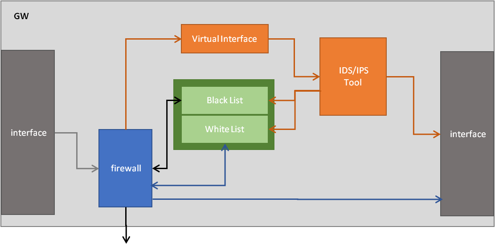

3장.  SCN-보안 게이트웨이 소프트웨어
=======================================

3.1 실행 코드 위변조 탐지 및 차단 기술 설계
--------------------------------------------------------

3.1.1 프로세스 구조
~~~~~~~~~~~~~~~~~~~~~

.. image:: images/HSM.png
   :scale: 20 %
   :alt: alternate text

1. 주기적 hash
    - 실행파일에 대한 hash 추출
2. hash 계산
3. 결과 보고

3.2 프라이버시보호를 위한 암호화 기술 설계
--------------------------------------------------------
Solid?

3.3 IoT 디바이스별 차등화 접근제어 기술 설계
--------------------------------------------------------
사용자 권한 별 Device 제어 관리

3.4 취약점 점검 도구 설계
--------------------------------------------------------

3.4.1 프로세스 구조
~~~~~~~~~~~~~~~~~~~~~

1. 보안 GW IP 목록 요청
2. 취약점 측정
3. 측정 결과 수집
4. 결과 보고

3.5 행위 이벤트 분석기반 공격 탐지/차단 기술 설계
--------------------------------------------------------
3.5.1 개요
~~~~~~~~~~~~~~~~~~~
보안 솔루션을 갖는 IoT 게이트웨이 시스템 개발을 위해 행위 이벤트 분석을 통한 게이트웨이 공격 탐지 및 차단 기술을 탑제함으로, 
주거환경 및 산업환경에서 안전한 네트워크 서비스를 제공한다.

보안 솔루션을 갖는 IoT 게이트웨이 시스템은 주거 생활 안전과 관련된 다양한 센서를 인터페이스하여 네트워크 통신을 연결하고  
개인 정보 등의 민감한 데이터 보호 및 댁내 침입 탐지 및 접근 제어를 제공하며,
산업 전반의 네트워킹 및 보안이 요구되는 영역에서 스마트 커넥티드 네트워킹 및 보안 솔루션 제공한다.

3.5.2 행위 이벤트 분석기반 공격 탐지/차단 기술
~~~~~~~~~~~~~~~~~~~~~~~~~~~~~~~~~~~~~~~~~~~~~~~~~~~~~~~~~

게이트 웨이 동작 시 행위 이벤트 분석기반 공격 탐지는 패킷 중 Black/White 리스트가 아닌 모든 패킷의 행위 이벤트를 분석하여 이상 행위를 
탐지하면 Black/White 리스트에 추가하여 파이어월에서 차단/허용하며, 공격이 탐지되지 않는 패킷은 정상 동작한다.

행위 이벤트 분석을 통해 공격이 탐지되어 추가된 Blak 리스트는 방화벽을 통해 차단되며, 패킷의 행위 이벤트를 분석한 결과가 일정 수준을 만족하면 
White 리스트로 관리되어 추가적인 분석없이 통과한다.

White 리스트로 관리되더라도 랜덤한 패킷을 추출하여 분석하여 White 리스트에서 제거해야 하는지 판단하여 안전한 네트워크 서비스를 제공한다.

이상행위는 다음과 같다.
 1. A
 2. B

3.6 IoT 보안 서비스 Register 관리 설계
------------------------------------------------------
3.6.1 Docker Registry
~~~~~~~~~~~~~~~~~~~~~~~~~~~~~~~~~~

3.6.1.1 개요
^^^^^^^^^^^^^^^^^^^^^^^^^^^^^
컨테이너를 이용하여 어플리케이션의 실행환경을 가상화하기 위해서 도커 이미지가 필요한 만큼 이미지의 관리 또한 중요하다.

특히 개발/운영 환경에서 CI/CD 를 적용하여 이미지를 배포 하는 경우에는 이미지를 로컬 환경에 보관하는 것보다 저장가능한 다른 저장소에 보관하는 것이 좋다. 

도커 측은 사용자가 컨테이너 생성을 위한 이미지를 저장하고 다른 사용자들과 공유할 수 있도록 컨테이너 이미지에 대한 저장소 서비스를 제공하고 있다. 

이를 통하여 사용자는 쉽게 이미지를 registry에 저장(push)하고 필요한 이미지를 받아올(pull) 수 있다.

이러한 registry 서비스는 공개유형에 따라 public, private 으로 구분 가능하다. 

docker public registry의 경우 모든 사람들이 자유롭게 이용할 수 있도록 이미지가 공개되어 있으며, 사용자들은 필요에 따라 자신이 원하는 이미지를 검색하고 해당 이미지를 사용할 수 있다. 

docker private registry는 사용자가 자신만의 별도의 registry를 따로 생성하여 custom image들을 보관할 수 있도록 해준다. 

3.6.1.2 Docker Private Registry 사용방법
^^^^^^^^^^^^^^^^^^^^^^^^^^^^^^^^^^^^^^^^^^^
* 설치가이드 참조

3.6.1.3 Registry 관리 화면
^^^^^^^^^^^^^^^^^^^^^^^^^^^^^

3.7 지능형 플랫폼 연동 설계
--------------------------------------------------------
ETRI 연동?
