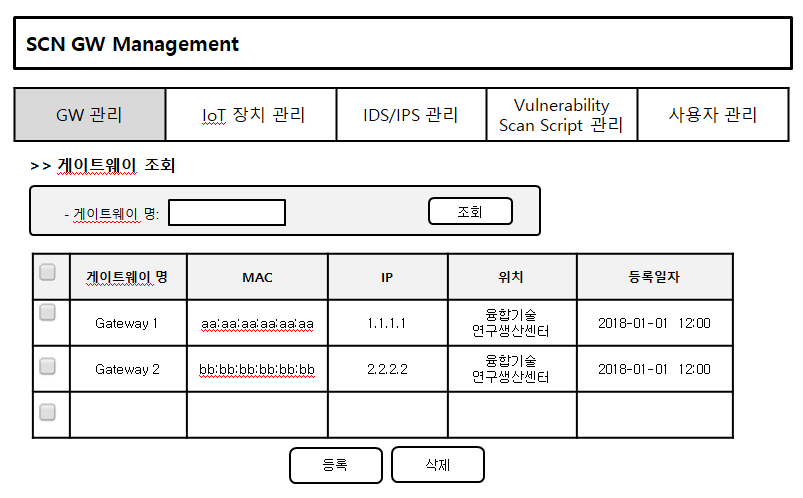
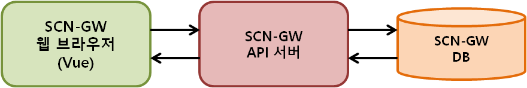
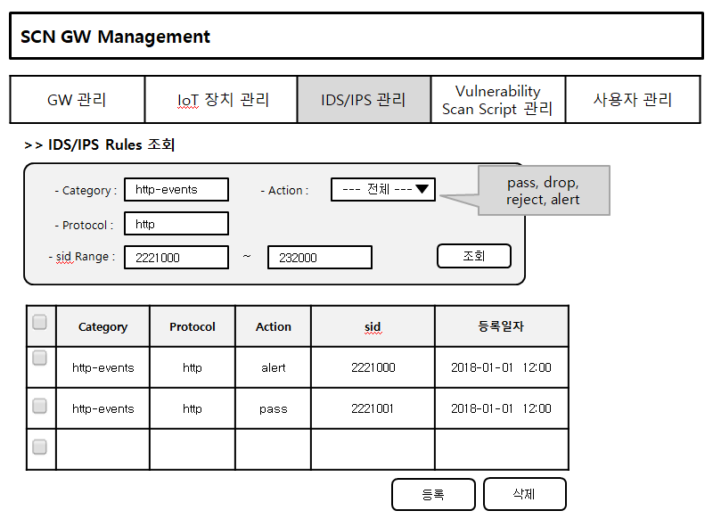

4장.  SCN-보안 게이트웨이 관제 시스템
=======================================

4.1 로컬 관리 콘솔 UI/UX 설계
--------------------------------------------------------
EdgeX 에서 현재 동작 중인 마이크로 서비스 리스트

EdgeX 에서 추가할 수 있는 마이크로 서비스 리스트

EdgeX  코어/메타 데이터 확인

실행 코드 관리

4.2 실시간 상태 모니터링 설계
--------------------------------------------------------
모니터링 화면 설계

4.3 SCN-보안 게이트웨이 관제 UI/UX 기술 설계
--------------------------------------------------------
4.3.1 게이트 웨이 관리
~~~~~~~~~~~~~~~~~~~~~~~

4.3.1.1 화면 설계
^^^^^^^^^^^^^^^^^^^^^^

1. SCN-GW 관리 페이지.
2. 지도에서 선택한 위치에 SCN-GW 를 추가 할 수 있다.
3. SCN-GW 에 연결된 Device 목록을 확인 할 수 있다.

4.3.1.2 프로세스 구조
^^^^^^^^^^^^^^^^^^^^^^^^

- SCN-GW 웹 브라우저는 Restful API를 사용하여 SCN-GW API 서버에 요청한다.
- SCN-GW API 서버는 SCN-GW 관리 인터페이스를 제공한다.
- SCN-GW API 서버는 전달받은 요청 결과를 SCN-GW 웹 브라우저에 전달한다.
- SCN-GW API 서버는 SCN-GW 웹 브라우저로 부터 전달된 SCN-GW 정보를 DB에 저장 관리 및 제공한다.

4.3.1.3 API
^^^^^^^^^^^^^^^^^^^^^^

====================  ==========  ============================================
Mapping Url           Method        Description
====================  ==========  ============================================
/{ctx}/gateways        POST         게이트웨이 등록
/{ctx}/gateways        GET          게이트웨이 목록 조회
/{ctx}/gateways/{id}   GET          게이트웨이 상세 조회
/{ctx}/gateways/{id}   PUT          게이트웨이 수정
/{ctx}/gateways/{id}   DELETE       게이트웨이 삭제
====================  ==========  ============================================

4.3.2 IoT 장치 관리
~~~~~~~~~~~~~~~~~~~~~~~

4.3.2.1 화면 그림넣기
^^^^^^^^^^^^^^^^^^^^^^

4.3.2.2 프로세스 구조
^^^^^^^^^^^^^^^^^^^^^^

4.3.2.3 API
^^^^^^^^^^^^^^^^^^^^^^

4.3.3 IDS/IPS Rule 관리
~~~~~~~~~~~~~~~~~~~~~~~~~~

4.3.3.1 화면 그림넣기
^^^^^^^^^^^^^^^^^^^^^^

1. IDS/IPS Rule 관리 페이지.
2. 행위 이벤트 공격 탐지/차단 Rule을 추가 할 수 있다.
3. category, protocol, sid range 검색조건에 따른 Rule 목록을 확인 할 수 있다.

4.3.3.2 프로세스 구조
^^^^^^^^^^^^^^^^^^^^^^

- SCN-GW 웹 브라우저는 Restful API를 사용하여 SCN-GW API 서버에 요청한다.
- SCN-GW API 서버는 IDS/IPS Rule 관리 인터페이스를 제공한다.
- SCN-GW API 서버는 전달받은 요청 결과를 SCN-GW 웹 브라우저에 전달한다.
- SCN-GW API 서버는 SCN-GW 웹 브라우저로 부터 전달된 IDS/IPS Rule 정보를 DB에 저장 관리 및 제공한다.

4.3.3.3 API
^^^^^^^^^^^^^^^^^^^^^^

====================  ==========  ============================================
Mapping Url           Method        Description
====================  ==========  ============================================
/{ctx}/rules          POST         IDS/IPS Rule 등록
/{ctx}/rules          GET          IDS/IPS Rule 목록 조회
/{ctx}/rules/{id}     GET          IDS/IPS Rule 상세 조회
/{ctx}/rules/{id}     PUT          IDS/IPS Rule 수정
/{ctx}/rules/{id}     DELETE       IDS/IPS Rule 삭제
====================  ==========  ============================================

4.3.4 Vulnerability Scan Script 관리
~~~~~~~~~~~~~~~~~~~~~~~~~~~~~~~~~~~~~~~

4.3.4.1 화면 그림넣기
^^^^^^^^^^^^^^^^^^^^^^

4.3.4.2 프로세스 구조
^^^^^^^^^^^^^^^^^^^^^^

4.3.4.3 API
^^^^^^^^^^^^^^^^^^^^^^

4.3.5 사용자 관리
~~~~~~~~~~~~~~~~~~~~~~~

4.3.5.1 화면 그림넣기
^^^^^^^^^^^^^^^^^^^^^^

4.3.5.2 프로세스 구조
^^^^^^^^^^^^^^^^^^^^^^

4.3.5.3 API
^^^^^^^^^^^^^^^^^^^^^^

4.4 알림 서비스 기술 설계
--------------------------------------------------------
장애 임계치 및 알람 관리

