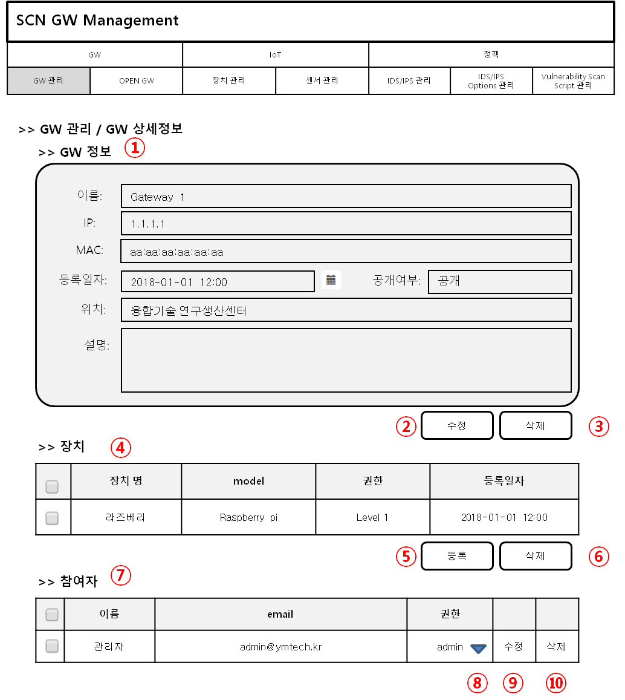
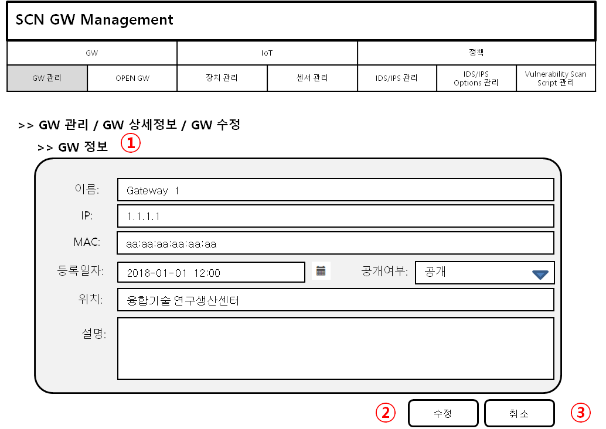
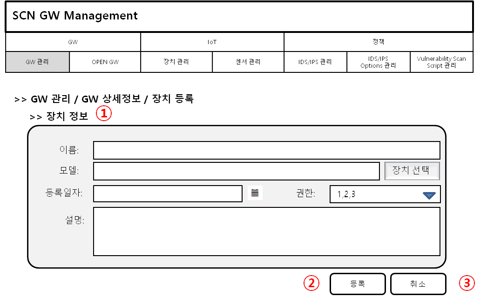
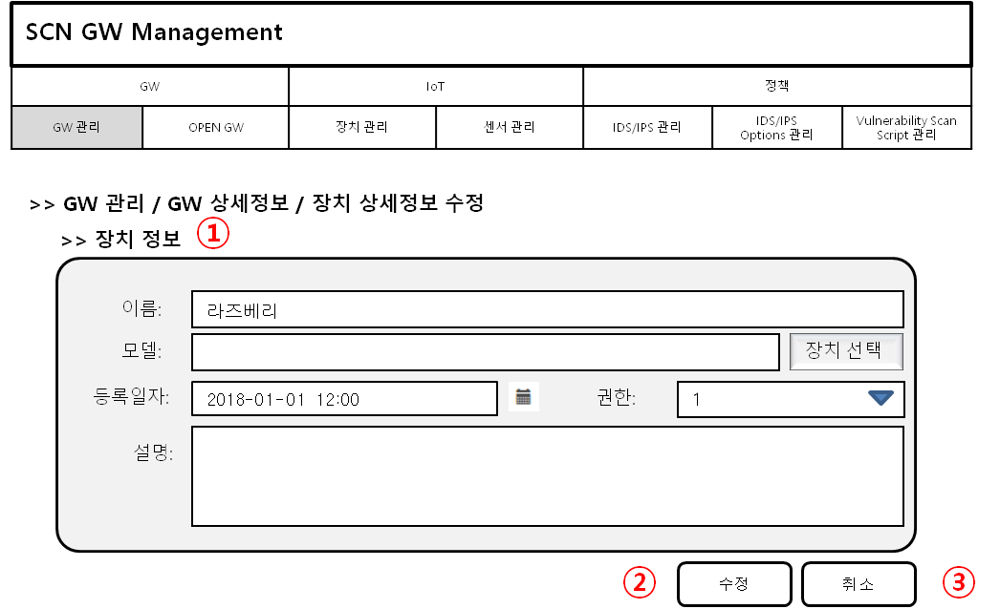
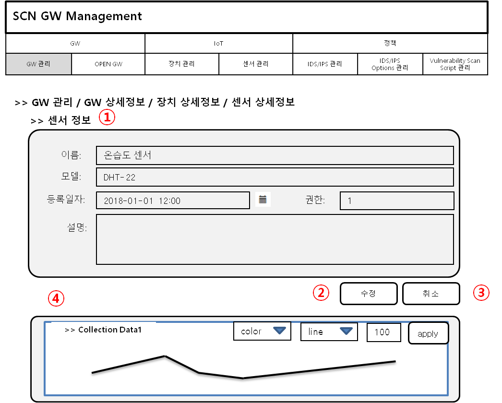
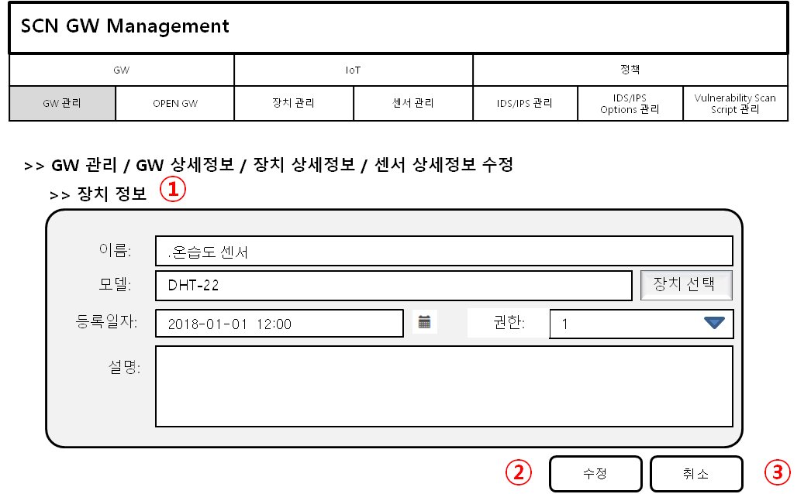
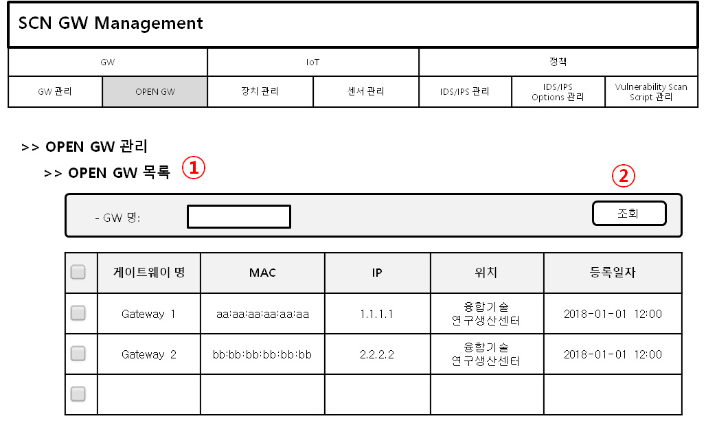
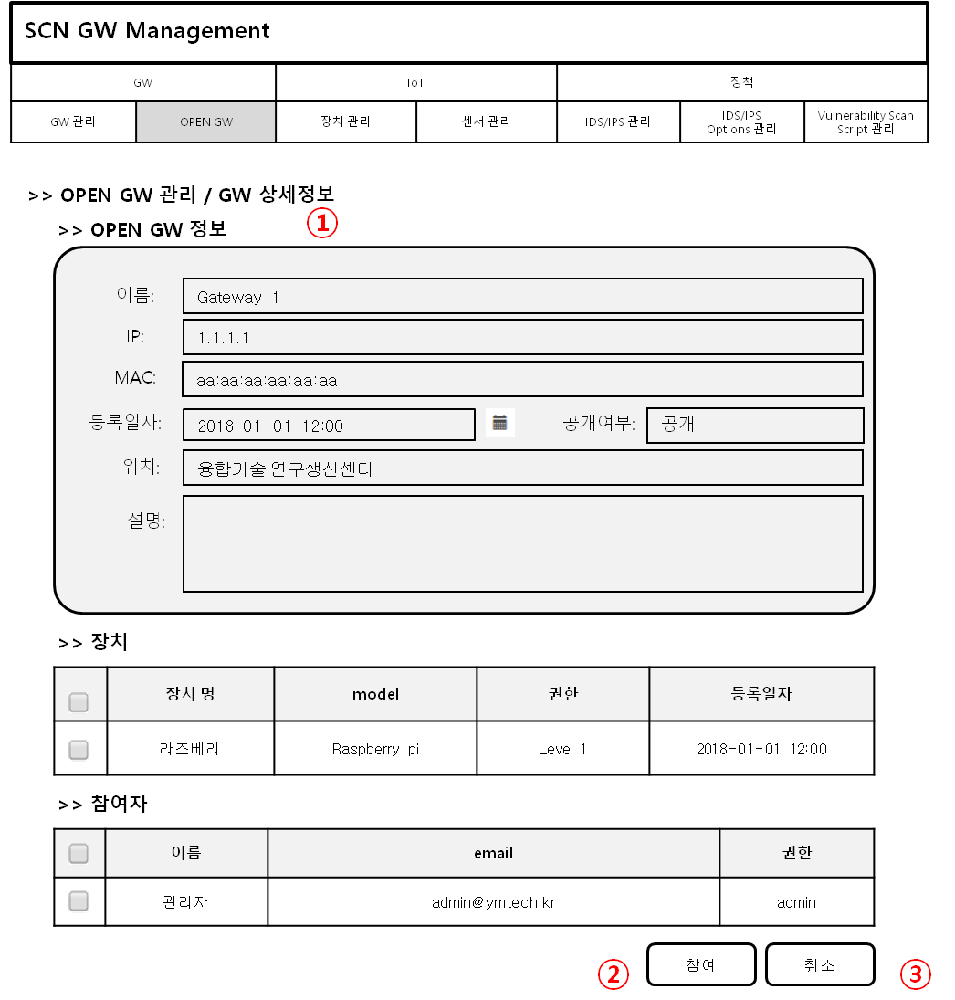

4장.  SCN-보안 게이트웨이 관제 시스템
=======================================

4.1 로컬 관리 콘솔 UI/UX 설계
--------------------------------------------------------

4.1.1 로컬 관리 콘솔 DB 설계
~~~~~~~~~~~~~~~~~~~~~~~~~~~~~~~~~~~~~~~~~~~~~~

4.3.1.1 유저 정보 테이블 (user_info)
^^^^^^^^^^^^^^^^^^^^^^^^^^^^^^^^^^^^^^^^^
+------------------+--------------------------+--------+------------+------+------------+--------------------------------------+
| 테이블명 :       | user_info                                                                                                 |
+==================+==========================+========+============+======+============+======================================+
| 설명 :           | 유저 정보 정보 테이블                                                                                     |
+------------------+--------------------------+--------+------------+------+------------+--------------------------------------+
| Foreign Key :    |                                                                                                           |
+------------------+--------------------------+--------+------------+------+------------+--------------------------------------+
| 인덱스 :         |                                                                                                           |
+------------------+--------------------------+--------+------------+------+------------+--------------------------------------+
| 컬럼명           | 타입                     | 크기   | 제한사항                       | Description                          |
+------------------+--------------------------+--------+------------+------+------------+--------------------------------------+
|                  |                          |        | PK         | FK   | NOT NULL   |                                      |
+------------------+--------------------------+--------+------------+------+------------+--------------------------------------+
| idx              | int                      | 11     | O          |      | O          | 유저 정보 IDX, AUTO INCREMENT        |
+------------------+--------------------------+--------+------------+------+------------+--------------------------------------+
| uid              | varchar                  | 20     |            |      | O          | 유저 ID                              |
+------------------+--------------------------+--------+------------+------+------------+--------------------------------------+
| password         | varchar                  | 20     |            |      | O          | 유저 비밀번호                        |
+------------------+--------------------------+--------+------------+------+------------+--------------------------------------+

실행 코드 관리

4.2 실시간 상태 모니터링 설계
--------------------------------------------------------
.. image:: images/4.2-모니터링화면.png
   :scale: 20 %
   :alt: alternate text

4.3 SCN-보안 게이트웨이 관제 UI/UX 기술 설계
--------------------------------------------------------

4.3.1 SCN-보안 게이트웨이 관제 시스템 DB 설계
~~~~~~~~~~~~~~~~~~~~~~~~~~~~~~~~~~~~~~~~~~~~~~

4.3.1.1 게이트웨이 정보 테이블 (gw_info)
^^^^^^^^^^^^^^^^^^^^^^^^^^^^^^^^^^^^^^^^^
+------------------+--------------------------+--------+------------+------+------------+--------------------------------------+
| 테이블명 :       | gw\_info                                                                                                  |
+==================+==========================+========+============+======+============+======================================+
| 설명 :           | 게이트웨이 정보 테이블                                                                                    |
+------------------+--------------------------+--------+------------+------+------------+--------------------------------------+
| Foreign Key :    |                                                                                                           |
+------------------+--------------------------+--------+------------+------+------------+--------------------------------------+
| 인덱스 :         |                                                                                                           |
+------------------+--------------------------+--------+------------+------+------------+--------------------------------------+
| 컬럼명           | 타입                     | 크기   | 제한사항                       | Description                          |
+------------------+--------------------------+--------+------------+------+------------+--------------------------------------+
|                  |                          |        | PK         | FK   | NOT NULL   |                                      |
+------------------+--------------------------+--------+------------+------+------------+--------------------------------------+
| idx              | int                      | 11     | O          |      | O          | 게이트웨이 IDX, AUTO INCREMENT       |
+------------------+--------------------------+--------+------------+------+------------+--------------------------------------+
| ip               | varchar                  | 20     |            |      | O          | 게이트웨이 IP                        |
+------------------+--------------------------+--------+------------+------+------------+--------------------------------------+
| mac              | varchar                  | 20     |            |      | O          | 게이트웨이 MAC                       |
+------------------+--------------------------+--------+------------+------+------------+--------------------------------------+
| serial\_number   | varchar                  | 20     |            |      | O          | 게이트웨이 시리얼번호                |
+------------------+--------------------------+--------+------------+------+------------+--------------------------------------+
| name             | varchar                  | 20     |            |      | O          | 게이트웨이 이름, UK                  |
+------------------+--------------------------+--------+------------+------+------------+--------------------------------------+
| location         | varchar                  | 64     |            |      | O          | 게이트웨이 설치 장소                 |
+------------------+--------------------------+--------+------------+------+------------+--------------------------------------+
| description      | varchar                  | 256    |            |      |            | 게이트웨이 설명                      |
+------------------+--------------------------+--------+------------+------+------------+--------------------------------------+
| reg\_date        | datetime                 |        |            |      | O          | 게이트웨이 등록 일자                 |
+------------------+--------------------------+--------+------------+------+------------+--------------------------------------+
| user\_id         | varchar                  | 36     |            |      | O          | 게이트웨이 등록자 ID                 |
+------------------+--------------------------+--------+------------+------+------------+--------------------------------------+
| is\_open         | int                      | 1      |            |      | O          | 공개여부 ( 0 : 비공개 / 1 : 공개 )   |
+------------------+--------------------------+--------+------------+------+------------+--------------------------------------+

4.3.1.2 디바이스 기본 정보 테이블 (device_shape)
^^^^^^^^^^^^^^^^^^^^^^^^^^^^^^^^^^^^^^^^^^^^^^^^^
+-----------------+-----------------------------+--------+------------+------+------------+------------------------------------------+
| 테이블명 :      | device\_shape                                                                                                    |
+=================+=============================+========+============+======+============+==========================================+
| 설명 :          | 디바이스 기본 정보 테이블                                                                                        |
+-----------------+-----------------------------+--------+------------+------+------------+------------------------------------------+
| Foreign Key :   |                                                                                                                  |
+-----------------+-----------------------------+--------+------------+------+------------+------------------------------------------+
| 인덱스 :        |                                                                                                                  |
+-----------------+-----------------------------+--------+------------+------+------------+------------------------------------------+
| 컬럼명          | 타입                        | 크기   | 제한사항                       | Description                              |
+-----------------+-----------------------------+--------+------------+------+------------+------------------------------------------+
|                 |                             |        | PK         | FK   | NOT NULL   |                                          |
+-----------------+-----------------------------+--------+------------+------+------------+------------------------------------------+
| idx             | int                         | 11     | O          |      | O          | 디바이스 기본 정보 IDX, AUTO INCREMENT   |
+-----------------+-----------------------------+--------+------------+------+------------+------------------------------------------+
| model           | varchar                     | 64     |            |      | O          | 디바이스 모델명                          |
+-----------------+-----------------------------+--------+------------+------+------------+------------------------------------------+
| description     | varchar                     | 256    |            |      |            | 디바이스 설명                            |
+-----------------+-----------------------------+--------+------------+------+------------+------------------------------------------+
| reg\_date       | datetime                    |        |            |      | O          | 디바이스 등록 일자                       |
+-----------------+-----------------------------+--------+------------+------+------------+------------------------------------------+
| user\_id        | varchar                     | 36     |            |      | O          | 디바이스 등록자 ID                       |
+-----------------+-----------------------------+--------+------------+------+------------+------------------------------------------+

4.3.1.3 디바이스 정보 테이블 (device_info)
^^^^^^^^^^^^^^^^^^^^^^^^^^^^^^^^^^^^^^^^^^^^^^^^^
+-----------------+------------------------+--------+------------+------+------------+------------------------------------------+
| 테이블명 :      | device\_info                                                                                                |
+=================+========================+========+============+======+============+==========================================+
| 설명 :          | 디바이스 정보 테이블                                                                                        |
+-----------------+------------------------+--------+------------+------+------------+------------------------------------------+
| Foreign Key :   |                                                                                                             |
+-----------------+------------------------+--------+------------+------+------------+------------------------------------------+
| 인덱스 :        |                                                                                                             |
+-----------------+------------------------+--------+------------+------+------------+------------------------------------------+
| 컬럼명          | 타입                   | 크기   | 제한사항                       | Description                              |
+-----------------+------------------------+--------+------------+------+------------+------------------------------------------+
|                 |                        |        | PK         | FK   | NOT NULL   |                                          |
+-----------------+------------------------+--------+------------+------+------------+------------------------------------------+
| idx             | int                    | 11     | O          |      | O          | 디바이스 기본 정보 IDX, AUTO INCREMENT   |
+-----------------+------------------------+--------+------------+------+------------+------------------------------------------+
| gw\_idx         | int                    | 11     |            | O    | O          | 게이트웨이 IDX                           |
+-----------------+------------------------+--------+------------+------+------------+------------------------------------------+
| name            | varchar                | 20     |            |      | O          | 디바이스 이름, UK                        |
+-----------------+------------------------+--------+------------+------+------------+------------------------------------------+
| model           | varchar                | 64     |            |      | O          | 디바이스 모델명                          |
+-----------------+------------------------+--------+------------+------+------------+------------------------------------------+
| description     | varchar                | 256    |            |      |            | 디바이스 설명                            |
+-----------------+------------------------+--------+------------+------+------------+------------------------------------------+
| reg\_date       | datetime               |        |            |      | O          | 디바이스 등록 일자                       |
+-----------------+------------------------+--------+------------+------+------------+------------------------------------------+
| user\_id        | varchar                | 36     |            |      | O          | 디바이스 등록자 ID                       |
+-----------------+------------------------+--------+------------+------+------------+------------------------------------------+
| dev\_level      | int                    | 11     |            |      | O          | 디바이스 권한 등급                       |
+-----------------+------------------------+--------+------------+------+------------+------------------------------------------+

4.3.1.4 센서 기본 정보 테이블 (sensor_shape)
^^^^^^^^^^^^^^^^^^^^^^^^^^^^^^^^^^^^^^^^^^^^^^^^^
+-----------------+-------------------------+--------+------------+------+------------+--------------------------------------+
| 테이블명 :      | sensor\_shape                                                                                            |
+=================+=========================+========+============+======+============+======================================+
| 설명 :          | 센서 기본 정보 테이블                                                                                    |
+-----------------+-------------------------+--------+------------+------+------------+--------------------------------------+
| Foreign Key :   |                                                                                                          |
+-----------------+-------------------------+--------+------------+------+------------+--------------------------------------+
| 인덱스 :        |                                                                                                          |
+-----------------+-------------------------+--------+------------+------+------------+--------------------------------------+
| 컬럼명          | 타입                    | 크기   | 제한사항                       | Description                          |
+-----------------+-------------------------+--------+------------+------+------------+--------------------------------------+
|                 |                         |        | PK         | FK   | NOT NULL   |                                      |
+-----------------+-------------------------+--------+------------+------+------------+--------------------------------------+
| idx             | int                     | 11     | O          |      | O          | 센서 기본 정보 IDX, AUTO INCREMENT   |
+-----------------+-------------------------+--------+------------+------+------------+--------------------------------------+
| model           | varchar                 | 64     |            |      | O          | 센서 모델명                          |
+-----------------+-------------------------+--------+------------+------+------------+--------------------------------------+
| description     | varchar                 | 256    |            |      |            | 센서 설명                            |
+-----------------+-------------------------+--------+------------+------+------------+--------------------------------------+
| reg\_date       | datetime                |        |            |      | O          | 센서 등록 일자                       |
+-----------------+-------------------------+--------+------------+------+------------+--------------------------------------+
| user\_id        | varchar                 | 36     |            |      | O          | 센서 등록자 ID                       |
+-----------------+-------------------------+--------+------------+------+------------+--------------------------------------+

4.3.1.5 센서 정보 테이블 (sensor_info)
^^^^^^^^^^^^^^^^^^^^^^^^^^^^^^^^^^^^^^^^^^^^^^^^^
+-----------------+--------------------+--------+------------+------+------------+--------------------------------------+
| 테이블명 :      | sensor\_info                                                                                        |
+=================+====================+========+============+======+============+======================================+
| 설명 :          | 센서 정보 테이블                                                                                    |
+-----------------+--------------------+--------+------------+------+------------+--------------------------------------+
| Foreign Key :   |                                                                                                     |
+-----------------+--------------------+--------+------------+------+------------+--------------------------------------+
| 인덱스 :        |                                                                                                     |
+-----------------+--------------------+--------+------------+------+------------+--------------------------------------+
| 컬럼명          | 타입               | 크기   | 제한사항                       | Description                          |
+-----------------+--------------------+--------+------------+------+------------+--------------------------------------+
|                 |                    |        | PK         | FK   | NOT NULL   |                                      |
+-----------------+--------------------+--------+------------+------+------------+--------------------------------------+
| idx             | int                | 11     | O          |      | O          | 센서 기본 정보 IDX, AUTO INCREMENT   |
+-----------------+--------------------+--------+------------+------+------------+--------------------------------------+
| dev\_idx        | int                | 11     |            |      | O          | 디바이스 IDX                         |
+-----------------+--------------------+--------+------------+------+------------+--------------------------------------+
| name            | varchar            | 20     |            |      | O          | 센서 이름, UK                        |
+-----------------+--------------------+--------+------------+------+------------+--------------------------------------+
| model           | varchar            | 64     |            |      | O          | 센서 모델명                          |
+-----------------+--------------------+--------+------------+------+------------+--------------------------------------+
| description     | varchar            | 256    |            |      |            | 센서 설명                            |
+-----------------+--------------------+--------+------------+------+------------+--------------------------------------+
| reg\_date       | datetime           |        |            |      | O          | 센서 등록 일자                       |
+-----------------+--------------------+--------+------------+------+------------+--------------------------------------+
| user\_id        | varchar            | 36     |            |      | O          | 센서 등록자 ID                       |
+-----------------+--------------------+--------+------------+------+------------+--------------------------------------+
| dev\_level      | int                | 11     |            |      | O          | 센서 권한 등급                       |
+-----------------+--------------------+--------+------------+------+------------+--------------------------------------+

4.3.1.6 센서 임계치 정보 테이블 (sensor_threshold)
^^^^^^^^^^^^^^^^^^^^^^^^^^^^^^^^^^^^^^^^^^^^^^^^^^^^
+-----------------+---------------------------+--------+------------+------+------------+-----------------------+
| 테이블명 :      | sensor\_threshold                                                                           |
+=================+===========================+========+============+======+============+=======================+
| 설명 :          | 센서 임계치 정보 테이블                                                                     |
+-----------------+---------------------------+--------+------------+------+------------+-----------------------+
| Foreign Key :   |                                                                                             |
+-----------------+---------------------------+--------+------------+------+------------+-----------------------+
| 인덱스 :        |                                                                                             |
+-----------------+---------------------------+--------+------------+------+------------+-----------------------+
| 컬럼명          | 타입                      | 크기   | 제한사항                       | Description           |
+-----------------+---------------------------+--------+------------+------+------------+-----------------------+
|                 |                           |        | PK         | FK   | NOT NULL   |                       |
+-----------------+---------------------------+--------+------------+------+------------+-----------------------+
| idx             | int                       | 11     | O          |      | O          | IDX, AUTO INCREMENT   |
+-----------------+---------------------------+--------+------------+------+------------+-----------------------+
| sen\_name       | varchar                   | 20     |            |      | O          | 센서 이름             |
+-----------------+---------------------------+--------+------------+------+------------+-----------------------+
| threshold       | int                       | 11     |            |      | O          | 임계치                |
+-----------------+---------------------------+--------+------------+------+------------+-----------------------+
| inequality      | int                       | 11     |            |      | O          | 부등호                |
+-----------------+---------------------------+--------+------------+------+------------+-----------------------+
| command         | varchar                   | 64     |            |      | O          | 명령                  |
+-----------------+---------------------------+--------+------------+------+------------+-----------------------+

4.3.1.7 장애 알림 이력 정보 테이블 (fault_history)
^^^^^^^^^^^^^^^^^^^^^^^^^^^^^^^^^^^^^^^^^^^^^^^^^^^^
+-----------------+------------------------------+--------+------------+------+------------+-----------------------+
| 테이블명 :      | fault\_history                                                                                 |
+=================+==============================+========+============+======+============+=======================+
| 설명 :          | 장애 알림 이력 정보 테이블                                                                     |
+-----------------+------------------------------+--------+------------+------+------------+-----------------------+
| Foreign Key :   |                                                                                                |
+-----------------+------------------------------+--------+------------+------+------------+-----------------------+
| 인덱스 :        |                                                                                                |
+-----------------+------------------------------+--------+------------+------+------------+-----------------------+
| 컬럼명          | 타입                         | 크기   | 제한사항                       | Description           |
+-----------------+------------------------------+--------+------------+------+------------+-----------------------+
|                 |                              |        | PK         | FK   | NOT NULL   |                       |
+-----------------+------------------------------+--------+------------+------+------------+-----------------------+
| idx             | int                          | 11     | O          |      | O          | IDX, AUTO INCREMENT   |
+-----------------+------------------------------+--------+------------+------+------------+-----------------------+
| thres\_idx      | int                          | 11     |            | O    | O          | 임계치 idx            |
+-----------------+------------------------------+--------+------------+------+------------+-----------------------+
| reg\_date       | datetime                     |        |            |      | O          | 발생 일자             |
+-----------------+------------------------------+--------+------------+------+------------+-----------------------+

4.3.1.8 게이트웨이 권한 요청 테이블 (auth_request)
^^^^^^^^^^^^^^^^^^^^^^^^^^^^^^^^^^^^^^^^^^^^^^^^^^^^
+-----------------+-------------------------------+--------+------------+------+------------+-----------------------+
| 테이블명 :      | auth\_request                                                                                   |
+=================+===============================+========+============+======+============+=======================+
| 설명 :          | 게이트웨이 권한 요청 테이블                                                                     |
+-----------------+-------------------------------+--------+------------+------+------------+-----------------------+
| Foreign Key :   |                                                                                                 |
+-----------------+-------------------------------+--------+------------+------+------------+-----------------------+
| 인덱스 :        |                                                                                                 |
+-----------------+-------------------------------+--------+------------+------+------------+-----------------------+
| 컬럼명          | 타입                          | 크기   | 제한사항                       | Description           |
+-----------------+-------------------------------+--------+------------+------+------------+-----------------------+
|                 |                               |        | PK         | FK   | NOT NULL   |                       |
+-----------------+-------------------------------+--------+------------+------+------------+-----------------------+
| idx             | int                           | 11     | O          |      | O          | IDX, AUTO INCREMENT   |
+-----------------+-------------------------------+--------+------------+------+------------+-----------------------+
| gw\_idx         | int                           | 11     |            | O    | O          | 게이트웨이 idx        |
+-----------------+-------------------------------+--------+------------+------+------------+-----------------------+
| user\_id        | int                           | 11     |            |      | O          | 요청자 ID             |
+-----------------+-------------------------------+--------+------------+------+------------+-----------------------+

4.3.1.9 게이트웨이 별 사용자 권한 관리 테이블 (gw_authority)
^^^^^^^^^^^^^^^^^^^^^^^^^^^^^^^^^^^^^^^^^^^^^^^^^^^^^^^^^^^^^
+-----------------+-----------------------------------------+--------+------------+------+------------+------------------+
| 테이블명 :      | gw\_authority                                                                                        |
+=================+=========================================+========+============+======+============+==================+
| 설명 :          | 게이트웨이 별 사용자 권한 관리 테이블                                                                |
+-----------------+-----------------------------------------+--------+------------+------+------------+------------------+
| Foreign Key :   |                                                                                                      |
+-----------------+-----------------------------------------+--------+------------+------+------------+------------------+
| 인덱스 :        |                                                                                                      |
+-----------------+-----------------------------------------+--------+------------+------+------------+------------------+
| 컬럼명          | 타입                                    | 크기   | 제한사항                       | Description      |
+-----------------+-----------------------------------------+--------+------------+------+------------+------------------+
|                 |                                         |        | PK         | FK   | NOT NULL   |                  |
+-----------------+-----------------------------------------+--------+------------+------+------------+------------------+
| user\_id        | int                                     | 11     | O          |      | O          | 사용자 ID        |
+-----------------+-----------------------------------------+--------+------------+------+------------+------------------+
| gw\_idx         | int                                     | 11     | O          |      | O          | 게이트웨이 idx   |
+-----------------+-----------------------------------------+--------+------------+------+------------+------------------+
| auth\_level     | int                                     | 11     |            |      | O          | 권한 등급        |
+-----------------+-----------------------------------------+--------+------------+------+------------+------------------+

4.3.2 SCN-보안 게이트웨이 관제 시스템 화면 설계
~~~~~~~~~~~~~~~~~~~~~~~~~~~~~~~~~~~~~~~~~~~~~~~~
4.3.2.1 게이트웨이 관리
^^^^^^^^^^^^^^^^^^^^^^^^^^^^^^^
4.3.2.1.1 게이트웨이 목록 조회
^^^^^^^^^^^^^^^^^^^^^^^^^^^^^^^
**게이트웨이 목록**

.. image:: images/4.3.2.1.1-게이트웨이목록.png
   :scale: 20 %
   :alt: alternate text

1. 자신이 등록한 GW 목록
2. GW 등록 페이지로 이동한다.
3. 선택된 GW를 삭제한다.
4. 자신이 참여한 GW 목록
5. 등록된 GW의 목록 조회 페이지로 이동한다.

4.3.2.1.2 게이트웨이 등록
^^^^^^^^^^^^^^^^^^^^^^^^^^^^^^^
**게이트웨이 등록**

1. GW 입력 정보
2. 입력된 정보로 등록
3. GW 조회 페이지로 이동

4.3.2.1.3 게이트웨이 상세정보
^^^^^^^^^^^^^^^^^^^^^^^^^^^^^^^
**게이트웨이 상세정보**

1. GW 상세 정보
2.GW 정보 수정 페이지로 이동
3.GW 삭제
4.GW에 연결된 장치 목록
5.GW에 연결할 장치 등록 페이지 이동
6.GW에 연결된 장치 삭제
7.GW 참여자 목록
8.참여자의 권한
9.참여자 권한 수정 가능하도록 토글
10. 해당 사용자 탈퇴

4.3.2.1.4 게이트웨이 수정
^^^^^^^^^^^^^^^^^^^^^^^^^^^^^^^
**게이트웨이 수정**

1. GW 입력 정보
2. 입력된 정보로 수정
3. GW 조회 페이지로 이동

4.3.2.1.5 장치 등록
^^^^^^^^^^^^^^^^^^^^^^^^^^^^^^^
**장치 등록**

1. 장치 입력 정보
2. 입력된 정보로 등록
3. GW 상세 조회 페이지로 이동

4.3.2.1.6 장치 상세정보
^^^^^^^^^^^^^^^^^^^^^^^^^^^^^^^
**장치 상세정보**

.. image:: images/4.3.2.1.6-장치상세정보.png
   :scale: 20 %
   :alt: alternate text

1. 장치 정보
2. 장치 정보 수정 페이지로 이동
3. GW 상세정보 페이지로 이동
4. 장치에 연결된 센서 목록
5. 센서 등록 페이지 이동
6. 센서 삭제

4.3.2.1.7 장치 수정
^^^^^^^^^^^^^^^^^^^^^^^^^^^^^^^
**장치 수정**

1. 장치 정보
2. 장치 정보 수정 
3. GW 상세정보 페이지로 이동

4.3.2.1.8 센서 등록
^^^^^^^^^^^^^^^^^^^^^^^^^^^^^^^
**센서 등록**

.. image:: images/4.3.2.1.8-센서등록.png
   :scale: 20 %
   :alt: alternate text

1. 센서 입력 정보
2. 입력된 정보로 등록
3. 장치 상세 조회 페이지로 이동

4.3.2.1.9 센서 상세정보
^^^^^^^^^^^^^^^^^^^^^^^^^^^^^^^
**센서 상세정보**

1. 장치 정보
2. 장치 정보 수정 페이지로 이동
3. 장치 상세정보 페이지로 이동
4. 실시간 센서 데이터

4.3.2.1.10 센서 수정
^^^^^^^^^^^^^^^^^^^^^^^^^^^^^^^
**센서 수정**

1. 센서 입력 정보
2. 입력된 정보로 수정
3. 장치 상세 조회 페이지로 이동

4.3.2.2 오픈 게이트웨이 관리
^^^^^^^^^^^^^^^^^^^^^^^^^^^^^^^
4.3.2.2.1 오픈 게이트웨이 목록 조회
^^^^^^^^^^^^^^^^^^^^^^^^^^^^^^^^^^^^^^
**오픈 게이트웨이 목록**

1. 오픈된 GW 목록
2. GW 명으로 조회

4.3.2.2.2 오픈 게이트웨이 상세정보
^^^^^^^^^^^^^^^^^^^^^^^^^^^^^^^^^^^^^^
**오픈 게이트웨이 상세정보**

1. 오픈된  상세정보
2. 해당 GW 참여 요청 
3. 오픈 게이트웨이 목록 페이지 이동

4.3.3 SCN-보안 게이트웨이 관제 시스템 프로세스 설계
~~~~~~~~~~~~~~~~~~~~~~~~~~~~~~~~~~~~~~~~~~~~~~~~~~~~

4.3.3.1 게이트웨이 관리
^^^^^^^^^^^^^^^^^^^^^^^^

**프로세스 구조**

.. image:: images/프로세스구조2.png
   :scale: 20 %
   :alt: alternate text

- SCN-GW 웹 브라우저는 Restful API를 사용하여 SCN-GW API 서버에 요청한다.
- SCN-GW API 서버는 SCN-GW 관리 인터페이스를 제공한다.
- SCN-GW API 서버는 전달받은 요청 결과를 SCN-GW 웹 브라우저에 전달한다.
- SCN-GW API 서버는 SCN-GW 웹 브라우저로 부터 전달된 SCN-GW 정보를 DB에 저장 관리 및 제공한다.

**API**

=======================  ==========  ============================================
Mapping Url              Method      Description
=======================  ==========  ============================================
/{ctx}/gateway           POST        게이트웨이 등록
/{ctx}/gateway           GET         게이트웨이 목록 조회
/{ctx}/gateway/{id}      GET         게이트웨이 상세 조회
/{ctx}/gateway/{id}      PUT         게이트웨이 수정
/{ctx}/gateway/{id}      DELETE      게이트웨이 삭제
/{ctx}/gateway/{name}    GET         게이트웨이 이름 중복체크
=======================  ==========  ============================================

4.3.3.2 디바이스 형상 관리
^^^^^^^^^^^^^^^^^^^^^^^^^^^

**프로세스 구조**

.. image:: images/프로세스구조2.png
   :scale: 20 %
   :alt: alternate text

- SCN-GW 웹 브라우저는 Restful API를 사용하여 SCN-GW API 서버에 요청한다.
- SCN-GW API 서버는 Device 형상 관리 인터페이스를 제공한다.
- SCN-GW API 서버는 전달받은 요청 결과를 SCN-GW 웹 브라우저에 전달한다.
- SCN-GW API 서버는 SCN-GW 웹 브라우저로 부터 전달된 Device 형상 정보를 DB에 저장 관리 및 제공한다.

**API**

=========================  ==========  ============================================
Mapping Url                Method      Description
=========================  ==========  ============================================
/{ctx}/shape/device        POST        Device 형상 등록
/{ctx}/shape/device        GET         Device 형상 목록 조회
/{ctx}/shape/device/{id}   GET         Device 형상 상세 조회
/{ctx}/shape/device/{id}   PUT         Device 형상 수정
/{ctx}/shape/device/{id}   DELETE      Device 형상 삭제
=========================  ==========  ============================================

4.3.3.3 디바이스 관리
^^^^^^^^^^^^^^^^^^^^^^^^

**프로세스 구조**

.. image:: images/프로세스구조2.png
   :scale: 20 %
   :alt: alternate text

- SCN-GW 웹 브라우저는 Restful API를 사용하여 SCN-GW API 서버에 요청한다.
- SCN-GW API 서버는 Device 관리 인터페이스를 제공한다.
- SCN-GW API 서버는 전달받은 요청 결과를 SCN-GW 웹 브라우저에 전달한다.
- SCN-GW API 서버는 SCN-GW 웹 브라우저로 부터 전달된 Device 정보를 DB에 저장 관리 및 제공한다.

**API**

========================  ==========  ============================================
Mapping Url               Method      Description
========================  ==========  ============================================
/{ctx}/device             POST        Device 등록
/{ctx}/device             GET         Device 목록 조회
/{ctx}/device/{id}        GET         Device 상세 조회
/{ctx}/device/{id}        PUT         Device 수정
/{ctx}/device/{id}        DELETE      Device 삭제
/{ctx}/device/{name}      GET         Device 이름 중복체크
========================  ==========  ============================================

4.3.3.4 센서 형상 관리
^^^^^^^^^^^^^^^^^^^^^^^^

**프로세스 구조**

.. image:: images/프로세스구조2.png
   :scale: 20 %
   :alt: alternate text

- SCN-GW 웹 브라우저는 Restful API를 사용하여 SCN-GW API 서버에 요청한다.
- SCN-GW API 서버는 센서 형상 관리 인터페이스를 제공한다.
- SCN-GW API 서버는 전달받은 요청 결과를 SCN-GW 웹 브라우저에 전달한다.
- SCN-GW API 서버는 SCN-GW 웹 브라우저로 부터 전달된 센서 형상 정보를 DB에 저장 관리 및 제공한다.

**API**

=========================  ==========  ============================================
Mapping Url                Method      Description
=========================  ==========  ============================================
/{ctx}/shape/sensor        POST        Sensor 형상 등록
/{ctx}/shape/sensor        GET         Sensor 형상 목록 조회
/{ctx}/shape/sensor/{id}   GET         Sensor 형상 상세 조회
/{ctx}/shape/sensor/{id}   PUT         Sensor 형상 수정
/{ctx}/shape/sensor/{id}   DELETE      Sensor 형상 삭제
=========================  ==========  ============================================

4.3.3.5 센서 관리
^^^^^^^^^^^^^^^^^^^^^^^^

**프로세스 구조**

.. image:: images/프로세스구조2.png
   :scale: 20 %
   :alt: alternate text

- SCN-GW 웹 브라우저는 Restful API를 사용하여 SCN-GW API 서버에 요청한다.
- SCN-GW API 서버는 센서 관리 인터페이스를 제공한다.
- SCN-GW API 서버는 전달받은 요청 결과를 SCN-GW 웹 브라우저에 전달한다.
- SCN-GW API 서버는 SCN-GW 웹 브라우저로 부터 전달된 센서 정보를 DB에 저장 관리 및 제공한다.

**API**

=======================  ==========  ============================================
Mapping Url              Method      Description
=======================  ==========  ============================================
/{ctx}/sensor            POST        Sensor 등록
/{ctx}/sensor            GET         Sensor 목록 조회
/{ctx}/sensor/{id}       GET         Sensor 상세 조회
/{ctx}/sensor/{id}       PUT         Sensor 수정
/{ctx}/sensor/{id}       DELETE      Sensor 삭제
/{ctx}/sensor/{name}     GET         Sensor 이름 중복체크
=======================  ==========  ============================================

4.3.3.6 센서 임계치 관리
^^^^^^^^^^^^^^^^^^^^^^^^^^^

**프로세스 구조**

.. image:: images/프로세스구조2.png
   :scale: 20 %
   :alt: alternate text

- SCN-GW 웹 브라우저는 Restful API를 사용하여 SCN-GW API 서버에 요청한다.
- SCN-GW API 서버는 센서 임계치 관리 인터페이스를 제공한다.
- SCN-GW API 서버는 전달받은 요청 결과를 SCN-GW 웹 브라우저에 전달한다.
- SCN-GW API 서버는 SCN-GW 웹 브라우저로 부터 전달된 센서 임계치 정보를 DB에 저장 관리 및 제공한다.

**API**

==============================  ==========  ============================================
Mapping Url                     Method      Description
==============================  ==========  ============================================
/{ctx}/sensor/threshold         POST        Sensor 임계치 등록
/{ctx}/sensor/threshold         GET         Sensor 임계치 목록 조회
/{ctx}/sensor/threshold/{id}    GET         Sensor 임계치 상세 조회
/{ctx}/sensor/threshold/{id}    PUT         Sensor 임계치 수정
/{ctx}/sensor/threshold/{id}    DELETE      Sensor 임계치 삭제
==============================  ==========  ============================================

4.3.3.7 장애 알림 이력 관리
^^^^^^^^^^^^^^^^^^^^^^^^^^^^

**프로세스 구조**

- oneM2M 서버는 검출 된 장애 알림 정보를 SCN-GW API 서버로 알림 정보를 전달하여 SCN-GW DB에 저장된다.
- SCN-GW 웹 브라우저는 Restful API를 사용하여 SCN-GW API 서버에 요청한다.
- SCN-GW API 서버는 장애 알람 이력 관리 인터페이스를 제공한다.
- SCN-GW API 서버는 전달받은 요청 결과를 SCN-GW 웹 브라우저에 전달한다.
- SCN-GW API 서버는 SCN-GW 웹 브라우저로 부터 전달된 장애 알람 이력 정보를 DB에 저장 관리 및 제공한다.

**API**

==============================  ==========  ============================================
Mapping Url                     Method      Description
==============================  ==========  ============================================
/{ctx}/falult/history           POST        Sensor 임계치 등록
/{ctx}/falult/history           GET         Sensor 임계치 목록 조회
/{ctx}/falult/history/{id}      GET         Sensor 임계치 상세 조회
/{ctx}/falult/history/{id}      PUT         Sensor 임계치 수정
/{ctx}/falult/history/{id}      DELETE      Sensor 임계치 삭제
==============================  ==========  ============================================

4.3.3.8 게이트웨이 권한 요청 관리
^^^^^^^^^^^^^^^^^^^^^^^^^^^^^^^^^^

**프로세스 구조**

.. image:: images/프로세스구조2.png
   :scale: 20 %
   :alt: alternate text

- SCN-GW 웹 브라우저는 Restful API를 사용하여 SCN-GW API 서버에 요청한다.
- SCN-GW API 서버는 게이트웨이 권한 요청 관리 인터페이스를 제공한다.
- SCN-GW API 서버는 전달받은 요청 결과를 SCN-GW 웹 브라우저에 전달한다.
- SCN-GW API 서버는 SCN-GW 웹 브라우저로 부터 전달된 게이트웨이 권한 요청 정보를 DB에 저장 관리 및 제공한다.

**API**

==============================  ==========  ============================================
Mapping Url                     Method      Description
==============================  ==========  ============================================
/{ctx}/gateway/auth/req         POST        게이트웨이 권한 요청 정보 등록
/{ctx}/gateway/auth/req         GET         게이트웨이 권한 요청 정보 목록 조회
/{ctx}/gateway/auth/req/{id}    GET         게이트웨이 권한 요청 정보 상세 조회
/{ctx}/gateway/auth/req/{id}    PUT         게이트웨이 권한 요청 정보 수정
/{ctx}/gateway/auth/req/{id}    DELETE      게이트웨이 권한 요청 정보 삭제
==============================  ==========  ============================================

4.3.3.9 게이트웨이 별 사용자 권한 관리
^^^^^^^^^^^^^^^^^^^^^^^^^^^^^^^^^^^^^^^

**프로세스 구조**

.. image:: images/프로세스구조2.png
   :scale: 20 %
   :alt: alternate text

- SCN-GW 웹 브라우저는 Restful API를 사용하여 SCN-GW API 서버에 요청한다.
- SCN-GW API 서버는 게이트웨이 별 사용자 권한 관리 인터페이스를 제공한다.
- SCN-GW API 서버는 전달받은 요청 결과를 SCN-GW 웹 브라우저에 전달한다.
- SCN-GW API 서버는 SCN-GW 웹 브라우저로 부터 전달된 게이트웨이 별 사용자 권한 정보를 DB에 저장 관리 및 제공한다.

**API**

=========================================  ==========  ============================================
Mapping Url                                Method      Description
=========================================  ==========  ============================================
/{ctx}/gateway/auth/apv                    POST        게이트웨이 별 사용자 권한 정보 등록
/{ctx}/gateway/auth/apv                    GET         게이트웨이 별 사용자 권한 목록 조회
/{ctx}/gateway/auth/apv/{userId}/{gwIdx}   GET         게이트웨이 별 사용자 권한 상세 조회
/{ctx}/gateway/auth/apv/{userId}/{gwIdx}   PUT         게이트웨이 별 사용자 권한 수정
/{ctx}/gateway/auth/apv/{userId}/{gwIdx}   DELETE      게이트웨이 별 사용자 권한 삭제
=========================================  ==========  ============================================

4.4 알림 서비스 기술 설계
--------------------------------------------------------
장애 임계치 및 알람 관리

