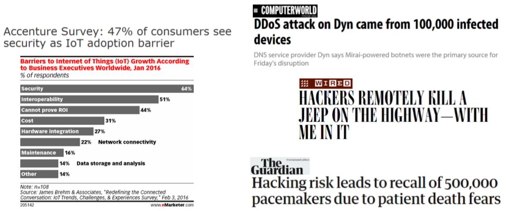
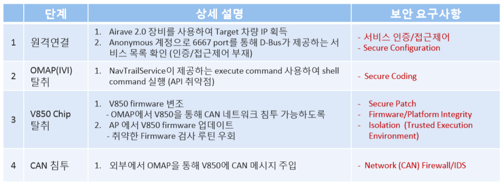
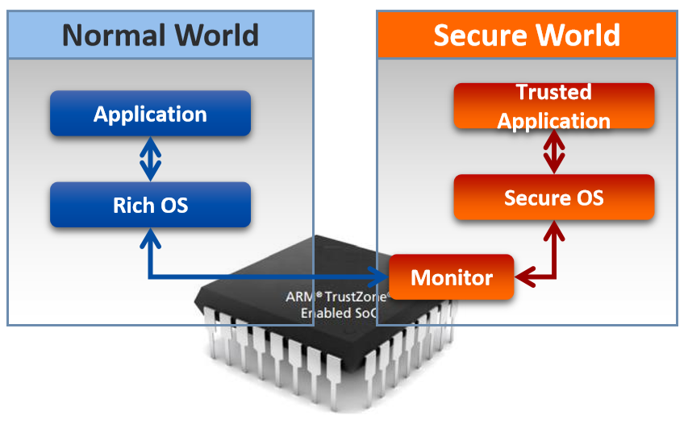

1장. 기술개발의 개요 및 필요성
=======================================

1.1 센서 접속 기술 배경
------------------------

• 센서 제품의 데이터 전달 통신 프로토콜 규격이 매우 다양하고, 제조사 자체 프로토콜을 사용하는 경우 많음 

• IoT, M2M 통합 연동을 위해, 표준화된 센서 노드 연동 프로토콜이 필요 

• IETF CORE(Constrained RESTful Environments) 작업그룹에서는, 제한된 시스템/네트 워크 자원에서도 적용할 수 있는 REST 기반 CoAP (Constrained Application Protocol) 의 표준화진행 

1.2 IoT 연결 기기의 급속한 증가와 IoT 보안 우려 증가 
----------------------------------------------------
• 2020년까지 300억개 IoT 기기 연결 예상[1], Home, Industry, Car, Health등 생활 전반에 연결 

• 보안 사고시 피해의 심각성으로 보안은 IoT 서비스 성공에 가장 중요한 요소 

1.3 IoT 보안 위협 사례 
-----------------------

1.3.1 Mirai Botnet (2016)
~~~~~~~~~~~~~~~~~~~~~~~~~~~

• 다수의 IoT 기기를 감염(Default Password 활용)시켜 특정 Target에 대한 DDoS Attack 수행 
• Dyn.com (DNS 서비스), OVH (프랑스 Cloud 서비스), Kerbs on Security site 등 피해
• 이후 다양한 유사 Botnet 출현 → 안전한 System Configuration (Password 관리 ) 필요

1.3.2 Chrysler Jeep Hacking (2015) 
~~~~~~~~~~~~~~~~~~~~~~~~~~~~~~~~~~~~~
• Jeep의 원격제어시연 (Charlie Miller with Wired) (최초의 자동차 원격 공격 시연) 
• Network 취약점, 내부 서비스 Code 취약점, 안전하지 않은 Firmware 관리 등 여러 단계의 취약점 활용 공격 
• Chrysler는 140만대 차량 Recall 

1.3.3 Tesla Hacking (2016, 2017)
~~~~~~~~~~~~~~~~~~~~~~~~~~~~~~~~~~
• Tencent의 Keen Security Lab에서 Wifi를 통한 Tesla Model S 원격 해킹 시연 (2016) → Linux CVE등 기존 알려진 취약점 활용 → Tesla는 취약점 공유 10일내 OTA를 통한 Bug Patch 수행  
• Tesla Model X 해킹 (2017) → 취약점 공개 없이 Patch 진행

1.3.4 약물 주입기(Infusion Pump)의 센서 해킹
~~~~~~~~~~~~~~~~~~~~~~~~~~~~~~~~~~~~~~~~~~~~~
• 적외선 레이저로 약물 주입기 센서를 해킹하고 오작동을 유발
   • 떨어지는 약액의 방울을 세를 드롭 센서(Drop Sensor)에 적외선을 비춰 오작동 유발 → 센서 스푸핑 (Sensor Spoofing)
   • 약물 주입기의 투약량을 65%까지 줄이거나 330%까지 과대 투약 가능

1.3.5 악성 코드 침투를 통한 공격
~~~~~~~~~~~~~~~~~~~~~~~~~~~~~~~~~~~~~~~~~~~~~
• 보안이 허술한 디바이스를 통해 악성 코드 삽입
• 네트워크 내의 다른 디바이스 감염
• 특정 서버 DDoS 공격, 디바이스 배터리 소모, 랜섬웨어 공격 등

1.3.6 초인종 해킹을 통한 장비 공격
~~~~~~~~~~~~~~~~~~~~~~~~~~~~~~~~~~~~~~~~~~~~~
• 펜테스트 파트너스(PenTest Partners)사가 IoT 초인종을 이용해 와이파이 패스워드를 획득하는 방법을 공개 → 다른 기기 공격 가능성 제시
• 집 밖에 설치되는 IoT 초인종을 분해하면, Wi-Fi에 연결하기 위한 무선 모듈 존재
• Gainspan에서 제조된 무선 모듈에는 웹서버 모듈이 포함됨
• 해당 웹서버 연결 시, 웹서버의 URL을 이용해 무선 모듈의 설정파일 권한을 획들할 수 있으며, 여기에 Wi-Fi의 SSID와 PSK 패스워드가 포함되어 있음.
• 이렇게 네트워크 엑세스 권한을 획득한 공격자는 다른 장비들을 공격할 수 있음.

1.3.7 CCTV에 악성코드 탑재
~~~~~~~~~~~~~~~~~~~~~~~~~~~~~~~~~~~~~~~~~~~~~
• 아마존에서 판매하고 있는 CCTV에 악성코드 탑재
   • CCTV가 DDoS 봇넷에 악용될 수 있도록 하는 악성코드가 발견됨
      • 2016년 6월말 DDoS 공격을 수사하는 과정에서 CCTV 2만 5천대로 구성된 봇넷이 발견됨
      • CCTV의 웹페이지의 하단부에 iframe이 존재

1.3.8 CCTV로 구성된 봇넷 발견
~~~~~~~~~~~~~~~~~~~~~~~~~~~~~~~~~~~~~~~~~~~~~
• 보안 전문업체인 Sucuri가 DDoS 공격을 조사하던 과정에서 발견
   • 초당 3만5천 건의 HTTP 요청을 생성하는 layer 7 attack or HTTP flooding attack
   • 공격에 사용된 사이트들은 크로스 웹 서버（cross web server)를 사용 중이었음

1.3.9 스마트홈 플랫폼 해킹
~~~~~~~~~~~~~~~~~~~~~~~~~~~~~~~~~~~~~~~~~~~~~
• 스마트홈 플랫폼인 SmartThings의 해킹 (2016.05)
   • 권한 분리 모델(Privilege separation model)을 구현하였으나, 충분히 세분화되어있지 않아서 특정한 앱이 과도한 권한을 사용할 수 있음
   • 스마트 도아락의 비밀번호 변경 정보를 탈취
   • 공격자용 비밀번호를 추가 (backdoor pin code injection attack)

1.4 사물인터넷 보안 공격 유형
------------------------------
.. table:: 
   :widths: 20, 80
   
   ==========================================  ========================================================
   공격명                                       설명
   ==========================================  ========================================================
   Interference / Jamming / Collision          
                                               - 노이즈 발생 / 동시 동일 주파수 접속 / 주파수 위변조 등을 통해 실제 신호의 정상적인 송수신을 방해하는 공격          
   Sybil      
                                               - 기존의 Wireless Ad-hoc이나 센서네트워크에서 Multi-Identity가 허용되는 취약점을 이용한 공격으로 각 디바이스나 센서에 Unique ID를 부여하지 않을 경우 발생
   Traffic Analysis                              
                                               - 암호화되지 않은 NPDU(패킷), DLPDU(프레임) 페이로드를 분석하여 정보를 취하는 공격 (단, 암호화 할 경우 상대적으로 안전하지만 System Performance에 영향이 갈 수 있음)
   Dos
                                               - 주변 노드(Node)에 지속적인 광고 패킷을 송신, DLPDU 반복 수정, CRC 반복 체크로 시스템에 무리를 주거나 주파수 Jamming 등을 통해 신호 송수신을 방해하는 공격
   De-synchronization
                                               - Device Pool에 잘못된 시간 정보를 송신하여 디바이스가 계속적으로 시간을 교정하는데 자원을 소모하도록 하는 공격
   Wormhole
                                               - 상호 통신이 허가되지 않은 두 디바이스의 무선 통신 모듈을 공격해 상호간 통신을 가능하게 만들고 통신 라우팅을 고의로 변경하거나 악성코드 배포 경로로 이용하는 공격
   Tampering
                                               - 단말에 저장된 데이터 혹은 송수신 데이터를 임의로 위변조하는 공격
   Eavesdropping
                                               - 암호화되지 않은 디바이스(센서)-Gateway 구간 정보를 도청하는 공격
   Selective Forwarding Attack
                                               - 선택적으로 특정 노드(Node)에 패킷을 포워딩 하지 않게 하여 해당 노드를 Blackhole로 만들어버리는 공격
   Spoofing
                                               - 네트워크에 공유된 Network-Key를 취득하여 허가되지 않은 Fake 디바이스(센서)를 네트워크에 접속시켜 악의적인 행위를 하도록 하는 공격
   전파 간섭을 이용한 오동작
                                               - ISM 대역과 같은 비면허 대역에 과도한 출력의 신호 및 다량의 트래픽을 발생시켜 통신을 마비
   데이터 패턴 분석 결과 이용
                                               - IoT 디바이스의 이용 데이터 및 이용 패턴을 분석해서, 이용자를 실시간 감시하거나 보안 관련 사고 유발
   배터리 소모를 통한 동작 정지
                                               - 과다한 패킷 전송이나 프로세싱을 유도함으로써 디바이스의 배터리를 소모시켜 동작하지 않도록 만듦
   디바이스 제어권 탈취
                                               - 디바이스의 제어권을 탈취함으로써 물리적인 사고를 유발
   ==========================================  ========================================================

1.5 사물인터넷 보안 사고로 인한 경제적 피해
-------------------------------------------
1.5.1 사물인터넷 보안 사고로 인한 경제적 피해 추산치 (조원)
~~~~~~~~~~~~~~~~~~~~~~~~~~~~~~~~~~~~~~~~~~~~~~~~~~~~~~~~~~~~~~~~~~~

1.5.2 전세계 사물인터넷 보안 지출 전망 (백만 달러)
~~~~~~~~~~~~~~~~~~~~~~~~~~~~~~~~~~~~~~~~~~~~~~~~~~~~~~~~~~

2장. 기술개발의 목표
=======================================

* 이기종 프로토콜 동시 지원 스마트 커넥티드 네트워킹 및 보안 솔루션을 갖는 IoT 게이트웨이 시스템 개발
   - 주거안전 SCN-보안 게이트웨이 및 보안플랫폼 상용화
   - 산업안전 SCN-보안 게이트웨이 및 보안플랫폼 상용화 
      1. 동시/다중 서비스 연동을 위한 표준 미들웨어 플랫폼 기반의 이기종 프로토콜을 지원하는 게이트웨이를 개발하고, 
      2. 게이트웨이에 정보보호 솔루션을 개발하여 탑재함으로, 주거환경 및 산업환경에서 안전한 네트워크 서비스를 제공하며, 
      3. 디바이스에서 들어오는 데이터를 플랫폼에 전송하고 지능형 플랫폼에서 분석/식별/예측한 결과를 디바이스에 전송하는 생활안전 지능형 플랫폼과 연동하고, 
      4. 리빙랩 환경에서 검증을 통하여 실증하는, 주거/산업 안전 SCN 상용 게이트웨이 및 보안 서비스 개발을 목표로 함

3장. IoT 보안 인증/규제 동향
=======================================
3.1 EU Cybersecurity Act (2017)
----------------------------------
• EU 통합 ICT cybersecurity certification framework 수립 제안 → Market 별 파편화된 보안 인증 제도로 인한 불합리 제거 
• 제품 특징에 따라 여러 Assurance Level (basic, substantial, high) 부여 예정 
• Certification scheme 구체화는 ENISA를 통해 진행

3.2 IoT Cybersecurity Improvement Act of 2017
-----------------------------------------------
• 미 정부 대상 판매 IoT 기기에 대한 보안 인증 법규 발의 
• 주요 특징 
    • NIST DB에 포함된 알려진 취약점이 없어야 함 
    • Secure Update • Industry Standard Protocol 
    • No fixed/hardcoded credentials 

3.3 Secure by Design Policy Paper (2018.03, UK )
--------------------------------------------------
• 13개항의 IoT 보안 요구사항 발표  
• 2018년 여름 확정 예정, 이후 법제화 가능성 존재 
   • No default passwords 
   • Implement a vulnerability disclosure policy 
   • Keep software updated 
   • Securely store credentials, security-sensitive data 
   • Communicate securely 
   • Minimize exposed attack surfaces
   • Ensure software integrity 
   • Ensure that personal data is protected 
   • Make systems resilient to outages 
   • Monitor system telemetry data
   • Make it easy for consumers to delete personal data 
   • Make installation and maintenance of devices easy
   • Validate input data

3.4 IoT 보안인증 서비스 (KISA)
-------------------------------
• 2017년 KISA 주관으로 IoT 보안 인증 서비스 시작 
• 규제 사항은 아니며 제조사/개발사가 자율적으로 신청하여 인증 
• 총 5개 분류에 대하여 Standard 41개, Lite 23개 보안 평가 항목 운영 

4장. 주요 보안 요구사항 및 기술
=======================================

4.1 Secure Development Lifecycle
---------------------------------------
• 개발 단계에서 보안을 고려하여 제품 설계 및 개발 진행함으로써 보안 Risk 최소화 필요       
   : 특정 보안 기술에만 의존하거나 최종 보안 검증만으로는 보안 요구사항 만족 어려움 
• 요구분석, 설계, 개발, 검증 개발 단계에서 필요한 보안 활동 수행을 위한 Process       
   : Microsoft Security Development Lifecycle       
   : OWASP Secure Software Development Lifecycle project

4.2 Data 암호화, 보안 통신, 인증
---------------------------------------
• 표준 암호 Algorithm/Protocol기반 Data 보안 및 보안 통신/인증 수행 필요 
   • NIST Cryptographic Algorithm Recommendation Example
   

• TLS (v1.2이상) 표준 프로토콜을 안전한 Configuration하에 사용
• Key 생성, 배포, 저장, 활용 폐기 등 전체 Key Lifecycle에 대한 안전한 관리 필요

• 안전한 암호 Module/Library 사용            
   ex) FIPS 140-2 대응 CMVP(Cryptographic Module Validation Program) 인증 암호 모듈              
       CAVP (Cryptography Algorithm Validation Program)  인증 암호 모듈 

4.3 IoT 연결 보안 기술 사례 (OCF/IoTivity)
-------------------------------------------
• 최초 기기 등록을 위한 Security Protocol (Just Works, PIN-based, Cert-based) 
• 표준 채널 보안 프로토콜 (TLS/DTLS) 기반 기기 상호 인증 및 Secure Communication 
• ACL (Access Control List) 기반 Device Resource에 대한 접근 제어

4.4 Access Control
----------------------
• Resource/Service에 대한 접근 제어 및 권한 최소화  
   • 권한이 없는 주체의 Resource에 대한 접근 금지를 통한 Resource 유출 방지 
   • 특정 Component에 대한 공격의 시스템 내 전파 최소화 
• Tizen Access Control Example 
   • Cynara: Application Privilege Management 
   • Smack: Domain간 Access Control/Sandboxing 
   • DAC : Resource Access Control 

4.5 HW기반 보안 요구 강화
----------------------------
• Hacking 고도화에 따라 HW 수준의 보안성 요구 증가 
   • Device Key등 Security Critical 정보는 HW 기반 보안을 통한 저장/처리 요구 
• HW 기반 Security Module 사용 확대 

.. image:: images/HW기반_보안요구강화.png
   :scale: 20 %
   :alt: alternate text

4.6 ARM TrustZone 기술 Smart Device Chip에서 저전력 IoT 향으로 확장
------------------------------------------------------------------------
• Cortex-A 대상 TrustZone 기술은 Mobile 기기 뿐 아니라 Smart TV, 가전 등 다양한 기기에 적용 
• IoT device를 위한 저전력 ‘Cortex-M 프로세서’용 TrustZone Architecture 발표 (2015.11) 
• Cortex-M TZ 기술 표준화를 위한 Platform Security Architecture  Release (2018. 3) 

4.7 Platform 위/변조 공격 탐지
-------------------------------
• OS 공격을 통한 권한 획득 시 OS Level의 보안 기능 무력화 → OS 자체적 보호 불가 
• Root of Trust/Trusted Computing Base 기반 OS/Firmware Integrity 보장 필요  
• 관련 기술  
   • Secure Boot / Protected Boot / Remote Attestation  
   • Runtime Integrity Protection   
      ex) Mirai Botnet은 Runtime에 메모리상에서만 동작 (Secure Boot으로 검출 불가) 
   • 기술 사례: Samsung KNOX’s TIMA

4.8. 구현 취약점 최소화 및 취약점 Patch
----------------------------------------
• 개발자 Secure Coding Guideline 교육 및 개발 과정 준수 
• SW 구현/검증 단계 구현 취약점 검증  
• Open Source 활용 알려진 취약점 검토 및 Patch  
   • CVE (Common Vulnerabilities and Exposures) by MITRE
   • NVD (National Vulnerability Database) by NIST
• 관련 기술  
   • Static/Dynamic Code Analysis 
   • Fuzzing 
   • Known Vulnerability Scanning

• 기술 사례
   • Automated Vulnerability Analysis System (Samsung Research) 
      • Build System 연동 CVE 자동 탐지 및 Fuzzing 제공 

.. image:: images/취약점Patch사례.png
   :scale: 20 %
   :alt: alternate text

4.9 Usable Security 및 사용자 인증
------------------------------------
• 제한적 User Interface를 가지는 다수의 IoT 기기를 위한 쉽고 안전한 사용자 인증  
• IoT 환경에서는 사용자가 보안 관리자 역할 → 손쉬운 보안 설정/관리 기능 제공 필요 

5장. 국내외 기술의 동향
=======================================

• OMA LWM2M 이란 
   • DM - 인터넷사업자, 이동통신사업자, 제조사 들은 배포되어 있는 각종 기기을 효과적으로 유지 보수 관리하기 위한 기술 및 규격
   • OMA LWM2M은 DM 기능과 응용서비스를 위한 리소스 체계도 포함한 표준

• Big Data 
   • 실시간 모니터링
      • 시스템 구성요소에 대한 공격 상황 추적 및 분석 
      • 응용 프로그램 상에서 사용자의 활동성을 모니터링하기 위해 다양한 소스에서 데이터를 수집 관리
   • 위협에 대한 인지
      • 위협과 공격패턴과 같은 비정상적인 활동을 정확히 인식할 수 있게 하는 최신 정보 체계 
   • 데이터 및 사용자 모니터링
      • 사용자 및 데이터 Context를 포함한 활동성을 모니터링 하여 침투탐지 및 오용탐지 
   • 응용 모니터링
      • 비정상 응용 프로그램의 활동성 모니터링 
   • 분석
      • 기계학습, 데이터마이닝, 네트워크마이닝 등을 활용하여 다양한 소스 정보의 특성 분석

• 국내 기술현황 및 동향 
   • IoT 환경에 적용 가능한 경량 국산 암호 알고리즘(HIGHT-2005년, LEA2012년)이 공개되고 있지만, IoT 기기에 실제 구현하고 적용하는 서비스 의 사례가 아직 많지 않음.
   • 2016년 4월 한국인터넷진흥원(KISA)은 ‘사물인터넷(IoT) 환경에서의 암호·인증기술 이용 안내서’를 발간하면서, 아두이노 보드용 암호알고리즘 (SEED, HIGHT, LEA, ARIA)을 공개함. 
   • 2000년 경 BACnet 등 국제 표준으로 채택되어 산업분야에서 사용 하고 있었으나, M2M 및 IoT 서비스가 부각되면서 단말의 수가 많아 지고 연동 이슈가 부각되면서 단순한 표준이 요구됨  
   • IETF에서 제안된 CoAP 표준 개발 완료에 따라 다양한 상위 표준 기관(OMA, IPSO, oneM2M, OIC) 및 분야에서 적용 중 
   • 웹기술 발전으로 모든 센서 정보를 웹에 통합하려는 연구들 진행 (구글, MS, NASA, OGC, 시스코 등)

• 국외 기술현황 및 동향 
   • 경량 암호 알고리즘에 대한 다양한 연구들 (CLEFIA-2007년, PRESENT-2007년, PRINCE-2012년)이 진행되어 왔으며, ISO는 IoT에 적용 가능한 경량 암호 알고리즘(HIGHT, PRESENT)을 표준화 진행. 
   • 임베디드 보안 솔루션으로 wolfSSL과 ARM의 mbedTLS에서 암호 알고 리즘을 공개용 소스로 제공되고 있지만, 제품화하기에는 라이선스 비용 이 있음. 

6장. 국내외 시장의 동향
=======================================

6.1 시장규모 전망
------------------
• 시장 분석 기관인 Machina Research에 따르면 2022년 세계 IoT 시장 규모는 1.2조 달러, 한국은 22.8조원에 달할 것으로 예측 
• (해외) 2013년 0.2조 달러에서 2022년 1.2조 달러로 연평균 22% 성장 예상, 부 문별 시장 비중에서 디바이스 부분은 2022년 37%를 차지할 것으로 예상됨 • (국내) 2013년 2.3조원에서 2022년 22.8조원으로 연평균 29% 성장예상, 부문별 시장 비중에서 디바이스 부분은 2022년 기준 전체 IoT 시장의 45%를 차지할 것 으로 예상됨

6.2 기술현황(기기권한관리기술)
------------------------------
• IBM, HP, SCO, SumMicrosystems, Miscosoft 등 서버 업체를 중심으로 자사의 운영체제에 다양한 보안기능을 탑재하여 CC인증을 획득하고 있음.
• 구글은 자사 안드로이드 운영체제내에 강제적 접근제어구조가 적용된 SELinux를 채용하여 퍼미션 기반의 자원접근권한을 관리하고 있음.
• ㈜시큐브, ㈜시큐브레인, ㈜테이스온넷, ㈜레드게이트 등이 접근제어와 다중 보안등급등의 기능을 적용하여 PC 및 서버 보안솔루션을 출시하고 있음.
• 삼성은 모일 운영체제인 Tizen 운영체제 내에 SMACK(SimpleMACforKernel) 구조를 채용하여 모일 환경에 적합한 강제적 접근제어를 제공하고 있음.

.. image:: images/기기권한관리기술_시장전망.png
   :scale: 20 %
   :alt: alternate text

6.3 기술현황 (사물인터넷용 경량 네트워크 보안 프로토콜 제품)
-----------------------------------------------------------------

• IETF 표준화 그룹에서는 안전한 IoT 서비스를 위해 경량화된 DTLS 프로토콜 적용을 제안하고 있음
• IP 기반의 기기 상호인증 및 키분배(PANA)에 관련한 경량 구현은 국/내외에 거의 없는 것으로 파악
• 국외의 경우 wolfSSL, ARM mbed SSL 등의 프로그램이 본 기술이 타겟으로 하는 경량 기기에 적용이 가능한 TLS/DTLS 프로토콜임
• 국내의 경우 경량 기기를 위한 경량 PANA/TLS/DTLS 기반 제품은 거의 없는 실정임

6.4 IoT 시장 현황
--------------------
• Gartner는 2014년 37.5억대로 추정되는 IoT 기기가 매년 22%증가하여 2020년에는 250억대에 이를 것 전망
• IoT 분야는 위치추적, 자동차, 원격관리제어, 물류, 유통, 금용, 보안, 공공안전, 의료, 자산관리, 가전, 원격 유지보수, 환경감시, 기상청, 보호관찰 등 다양 
• 사물인터넷 시장은 2022년 1200조원 규모로 성장 예상
• IoT 시장 고도 성장 예상

